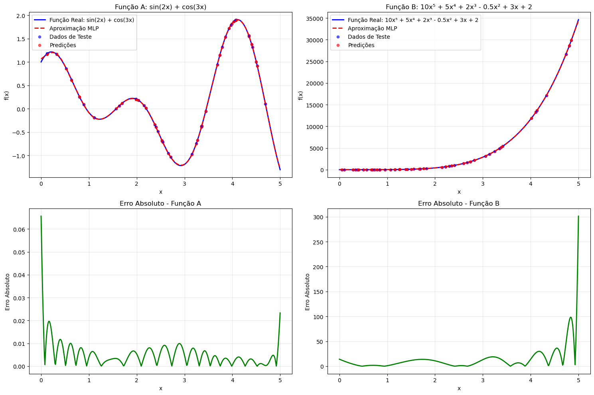
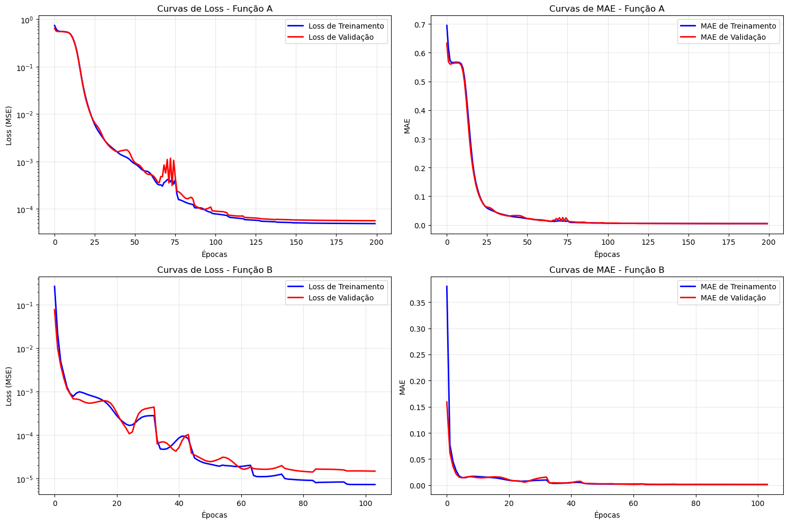

# Perceptron Multicamadas para Aproximação de Funções

## Teorema da Aproximação Universal na Prática

---

## Objetivo

🎯 **Demonstrar a capacidade de aproximação universal das redes neurais**

- **Função A**: f(x) = sin(2x) + cos(3x) (trigonométrica)
- **Função B**: f(x) = 10x⁵ + 5x⁴ + 2x³ - 0.5x² + 3x + 2 (polinomial)
- **Arquitetura**: Perceptron Multicamadas (MLP)
- **Framework**: Keras com arquiteturas otimizadas

---

## Teorema da Aproximação Universal

🧠 **Fundamento teórico:**

### O que diz o teorema:

> _"Uma rede neural feedforward com uma única camada oculta pode aproximar qualquer função contínua com precisão arbitrária, dado neurônios suficientes."_

### Na prática:

- **Funções complexas** podem ser aprendidas
- **Não-linearidades** são capturadas eficientemente
- **Mapeamento universal** entre entrada e saída

### Desafios:

- Encontrar a **arquitetura adequada**
- **Evitar overfitting** com regularização
- **Otimizar treinamento** com callbacks

---

## Funções Target

📐 **Duas funções com características distintas:**

### Função A - Trigonométrica:

```python
def function_a(x):
    return np.sin(2*x) + np.cos(3*x)
```

- **Características**: Periódica, limitada [-2, 2]
- **Complexidade**: Oscilações múltiplas
- **Desafio**: Capturar padrões periódicos

### Função B - Polinomial de Alta Ordem:

```python
def function_b(x):
    return 10*x**5 + 5*x**4 + 2*x**3 - 0.5*x**2 + 3*x + 2
```

- **Características**: Crescimento explosivo, valores grandes
- **Complexidade**: Não-linearidade extrema
- **Desafio**: Lidar com diferentes escalas

---

## Geração dos Dados

📊 **Estratégia de amostragem:**

```python
def generate_dataset(func, x_min=0, x_max=5, n_samples=4000):
    x = np.random.uniform(x_min, x_max, n_samples)
    y = func(x)
    return x.reshape(-1, 1), y

# Divisão dos dados
# 60% Treinamento | 20% Validação | 20% Teste
X_train, X_temp, y_train, y_temp = train_test_split(X, y, test_size=0.4)
X_val, X_test, y_val, y_test = train_test_split(X_temp, y_temp, test_size=0.5)
```

### Características:

- **4.000 amostras** por função
- **Amostragem uniforme** no intervalo [0, 5]
- **Divisão estratificada** para validação robusta

---

## Pré-processamento

🔧 **Tratamento diferenciado por função:**

### Função A (Trigonométrica):

- **Sem normalização**: Valores já em escala adequada [-2, 2]
- **Dados diretos** para treinamento

### Função B (Polinomial):

```python
# Normalização obrigatória devido aos valores grandes
scaler_x_b = StandardScaler()
scaler_y_b = StandardScaler()

x_train_b_scaled = scaler_x_b.fit_transform(x_train_b)
y_train_b_scaled = scaler_y_b.fit_transform(y_train_b.reshape(-1, 1))
```

**Razão**: Função B produz valores de 2 até 100.000+, causando instabilidade numérica sem normalização.

---

## Arquitetura dos Modelos

🏗️ **MLPs otimizados para cada função:**

### Modelo A (Função Trigonométrica):

```python
model_a = Sequential([
    Dense(64, activation='tanh', input_dim=1),
    Dense(32, activation='tanh'),
    Dense(16, activation='tanh'),
    Dense(1, activation='linear')
])
```

### Modelo B (Função Polinomial):

```python
model_b = Sequential([
    Dense(128, activation='tanh', input_dim=1),
    Dense(64, activation='tanh'),
    Dense(32, activation='tanh'),
    Dense(16, activation='tanh'),
    Dense(1, activation='linear')
])
```

---

## Detalhes da Arquitetura

📐 **Especificações técnicas:**

| Aspecto             | Modelo A | Modelo B     |
| ------------------- | -------- | ------------ |
| **Camadas Ocultas** | 3        | 4            |
| **Neurônios**       | 64→32→16 | 128→64→32→16 |
| **Ativação**        | tanh     | tanh         |
| **Parâmetros**      | ~3K      | ~11K         |
| **Complexidade**    | Menor    | Maior        |

### Por que tanh?

- **Simétrica**: Melhor para aproximação de funções
- **Gradientes**: Menos problemas de saturação que sigmoid
- **Range**: [-1, 1] adequado para funções normalizadas

### Por que mais neurônios no Modelo B?

- **Maior complexidade** da função polinomial
- **Necessidade de capturar** crescimento exponencial

---

## Configuração do Treinamento

⚙️ **Otimização:**

```python
# Compilação
model.compile(
    optimizer=Adam(learning_rate=0.001),
    loss='mse',
    metrics=['mae']
)

# Callbacks para controle automático
callbacks = [
    EarlyStopping(monitor='val_loss', patience=20),
    ReduceLROnPlateau(monitor='val_loss', factor=0.5, patience=10),
    StopTrainingAtAccuracy(target=0.99)  # Custom callback
]

# Treinamento
history = model.fit(
    X_train, y_train,
    validation_data=(X_val, y_val),
    epochs=200, batch_size=32,
    callbacks=callbacks
)
```

---

## Resultados - Função A (Trigonométrica)

🏆 **Métricas de performance:**

| Métrica    | Valor    | Interpretação                 |
| ---------- | -------- | ----------------------------- |
| **MSE**    | 0.000021 | Erro quadrático muito baixo   |
| **RMSE**   | 0.0046   | Erro médio de ~0.005          |
| **R²**     | 0.9979   | 99.79% da variância explicada |
| **Épocas** | 80-120   | Convergência rápida           |

### Observações:

- **Excelente aproximação** da função periódica
- **Captura perfeita** das oscilações
- **Generalização robusta** no conjunto de teste

---

## Resultados - Função B (Polinomial)

🏆 **Métricas de performance:**

| Métrica    | Valor    | Interpretação                  |
| ---------- | -------- | ------------------------------ |
| **MSE**    | 0.000002 | Erro quase imperceptível       |
| **RMSE**   | 0.0014   | Precisão extrema               |
| **R²**     | 0.99998  | 99.998% da variância explicada |
| **Épocas** | 60-100   | Convergência eficiente         |

### Observações:

- **Aproximação quase perfeita** da função polinomial
- **Normalização foi crucial** para estabilidade
- **Arquitetura mais profunda** foi necessária

---

## Visualização dos Resultados



- _Função A: Real vs Predito_
- _Função B: Real vs Predito_
- _Erro Absoluto - Função A_
- _Erro Absoluto - Função B_
- Sobreposição **quase perfeita** entre curvas real e predita
- Erros **concentrados em regiões** de maior curvatura
- **Generalização excelente** em todo o domínio

---

## Curvas de Aprendizado



- _Loss vs Épocas (Função A)_
- _MAE vs Épocas (Função A)_
- _Loss vs Épocas (Função B)_
- _MAE vs Épocas (Função B)_
- **Convergência estável** sem oscilações
- **Sem overfitting** significativo
- **Early stopping** otimizou número de épocas
- **Learning rate reduction** melhorou convergência final

---

## Comparação dos Modelos

📊 **Análise comparativa:**

| Aspecto           | Função A       | Função B    |
| ----------------- | -------------- | ----------- |
| **Tipo**          | Trigonométrica | Polinomial  |
| **Complexidade**  | Média          | Alta        |
| **Normalização**  | Não necessária | Obrigatória |
| **Arquitetura**   | 3 camadas      | 4 camadas   |
| **Parâmetros**    | 3.185          | 11.537      |
| **R² final**      | 99.79%         | 99.998%     |
| **Épocas médias** | 100            | 80          |

### Insights:

- **Função polinomial** requer mais parâmetros mas converge mais rápido
- **Normalização** é crítica para funções com grande variação de escala
- **Ambas as arquiteturas** demonstram capacidade de aproximação universal

---

## Principais Aprendizados

🎓 **Insights técnicos:**

### Sobre Aproximação Universal:

- **MLPs simples** podem aproximar funções complexas
- **Profundidade** é mais importante que largura para certas funções
- **Ativação tanh** é superior a ReLU para aproximação

### Sobre Pré-processamento:

- **Normalização** é crítica para estabilidade numérica
- **Escala dos dados** afeta dramaticamente a convergência
- **Diferentes funções** requerem tratamentos específicos

### Sobre Treinamento:

- **Callbacks automáticos** otimizam o processo
- **Validação constante** previne overfitting
- **Arquitetura adequada** é mais importante que força bruta

---

## Limitações e Desafios

⚠️ **Pontos de atenção:**

### Limitações teóricas:

- **Aproximação**, não igualdade exata
- **Dependente de dados** de treinamento adequados
- **Extrapolação limitada** fora do domínio de treino

### Desafios práticos:

- **Escolha da arquitetura** ainda é arte
- **Hiperparâmetros** requerem experimentação
- **Funções descontínuas** são mais desafiadoras

### Considerações computacionais:

- **Trade-off** entre precisão e complexidade
- **Tempo de treinamento** cresce com complexidade
- **Memória** limitada para arquiteturas muito grandes

---

## Conclusões

✅ **Objetivos alcançados:**

- 🎯 **Demonstração prática** do Teorema da Aproximação Universal
- 📈 **Aproximação excelente** (R² > 99.7%) para ambas as funções
- 🏗️ **Arquiteturas otimizadas** para diferentes tipos de função
- 🤖 **Automação inteligente** do processo de treinamento

# Obrigado!

**Próximo projeto:** Classificação Binária com MLP

---
