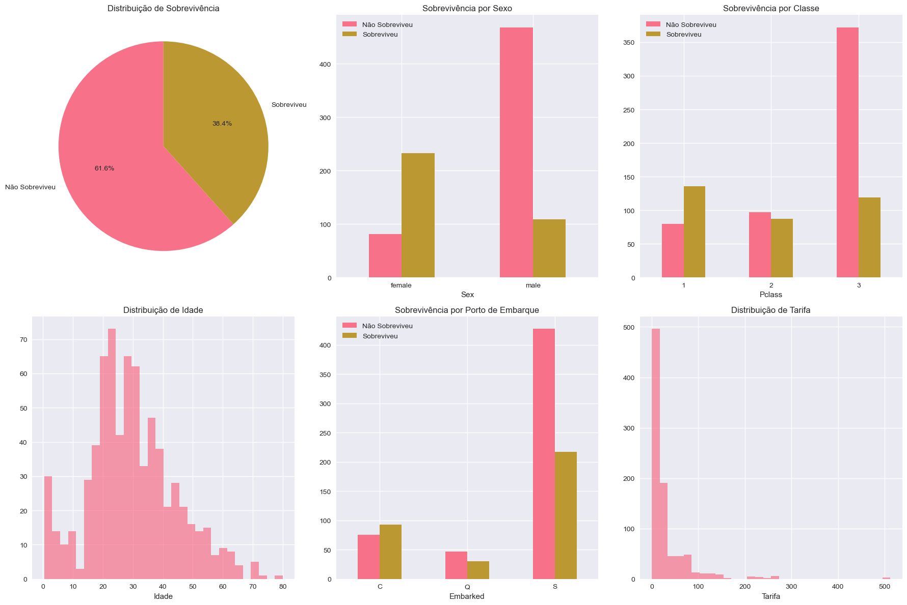
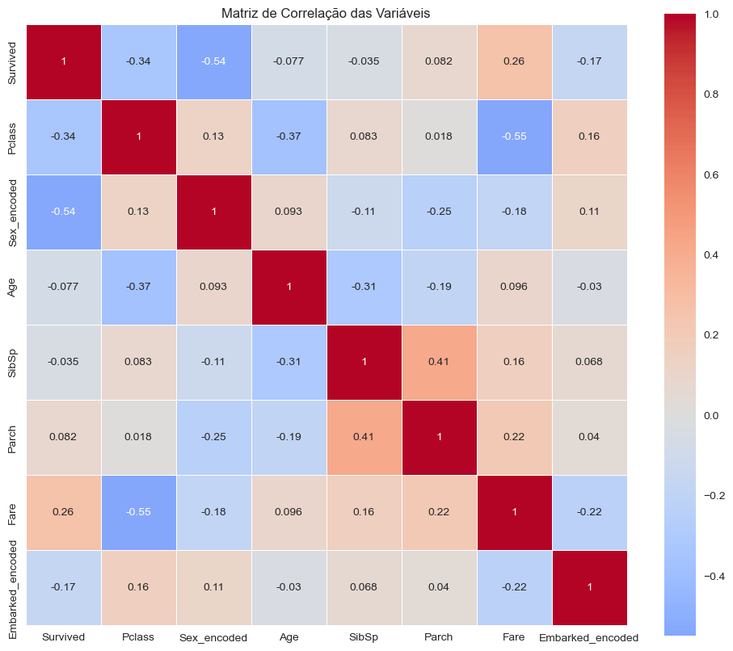
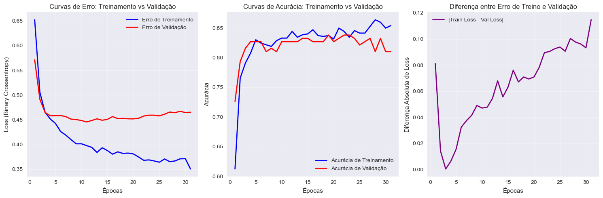
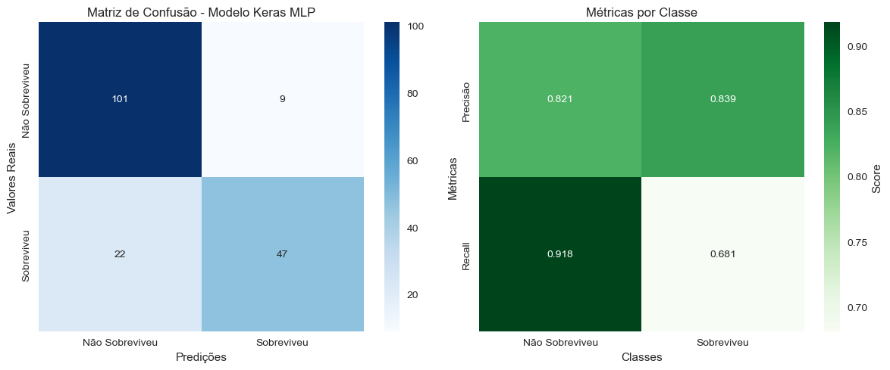
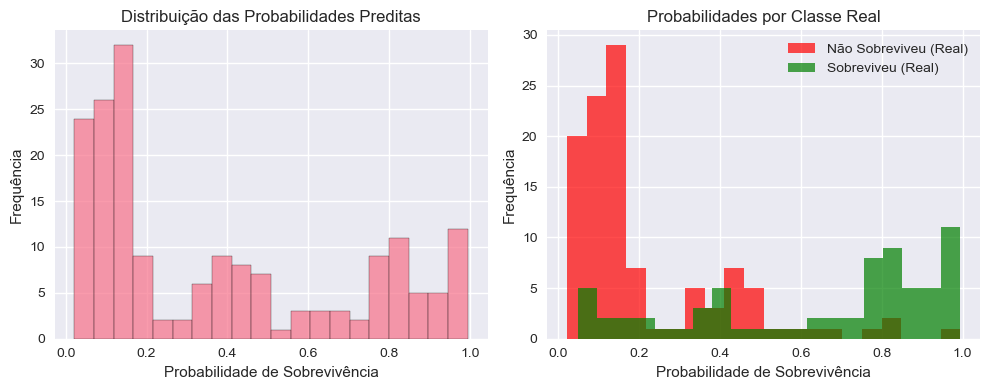
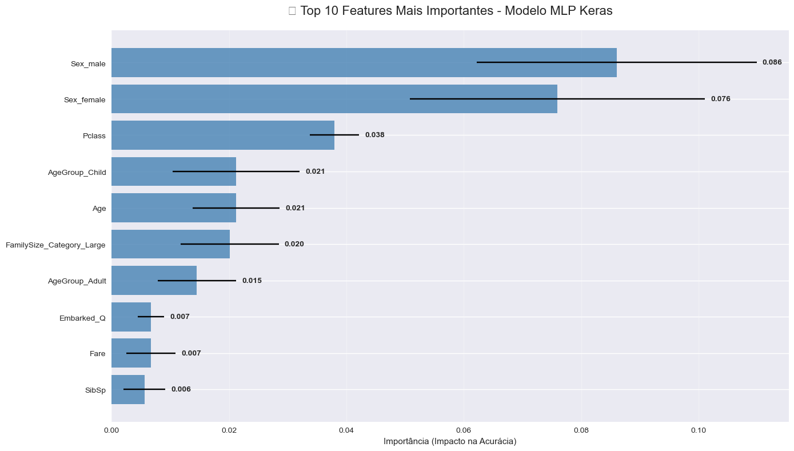

# Predição de Sobrevivência no Titanic

## Classificação Binária com MLP

---

## Objetivo

**Prever a sobrevivência de passageiros do Titanic usando redes neurais**

- **Problema**: Classificação binária (sobreviveu/não sobreviveu)
- **Dataset**: Dados históricos de passageiros
- **Arquitetura**: MLP com regularização
- **Framework**: Keras

---

## O Desastre do Titanic

**Contexto histórico:**

### O que aconteceu:

- **14 de abril de 1912**: Naufrágio do RMS Titanic
- **2.224 pessoas** a bordo
- **1.514 mortes** - uma das maiores tragédias marítimas
- **"Mulheres e crianças primeiro"** - protocolo de evacuação

### Por que é importante para ML:

- **Dados reais** com impacto humano
- **Padrões sociais** claros nos dados
- **Desbalanceamento** representa situações reais

---

## Dataset e Análise Exploratória

**Características dos dados:**

- **891 passageiros** no conjunto de treino
- **418 passageiros** no conjunto de teste
- **Taxa de sobrevivência**: 38.4% (desbalanceado)
- **12 features** originais + engenharia de características

```python
# Carregamento dos dados
train_df = pd.read_csv('DATA/train.csv')
test_df = pd.read_csv('DATA/test.csv')

print(f"Taxa de Sobrevivência: {train_df['Survived'].mean():.2%}")
```

### Principais variáveis:

- **Pclass**: Classe do bilhete (1ª, 2ª, 3ª classe)
- **Sex**: Sexo do passageiro
- **Age**: Idade
- **Fare**: Tarifa paga
- **Embarked**: Porto de embarque

---

## Análise de Valores Ausentes

**Tratamento de dados faltantes:**

| Variável     | Valores Ausentes | Estratégia                 |
| ------------ | ---------------- | -------------------------- |
| **Age**      | 177 (19.9%)      | Preenchimento com mediana  |
| **Embarked** | 2 (0.2%)         | Preenchimento com moda     |
| **Cabin**    | 687 (77.1%)      | Removida (muitos ausentes) |
| **Fare**     | 1 (teste)        | Preenchimento com mediana  |

```python
# Tratamento de valores ausentes
df['Age'].fillna(df['Age'].median(), inplace=True)
df['Embarked'].fillna(df['Embarked'].mode()[0], inplace=True)
```

**Estratégia conservadora**: Evitar introduzir viés com imputações complexas.

---

## Visualizações Exploratórias



- _Distribuição de sobrevivência (pizza)_
- _Sobrevivência por sexo (barras)_
- _Sobrevivência por classe (barras)_
- _Distribuição de idade (histograma)_
- _Sobrevivência por porto de embarque_
- _Distribuição de tarifa_

**Insights visuais:**

- **Mulheres** tiveram taxa de sobrevivência muito maior
- **1ª classe** sobreviveu mais que 2ª e 3ª classes
- **Crianças** tiveram maior chance de sobrevivência
- **Porto de embarque** influenciou na sobrevivência

---

## Análise de Correlação



**Correlações principais com sobrevivência:**

| Variável        | Correlação | Interpretação                         |
| --------------- | ---------- | ------------------------------------- |
| **Sex_encoded** | -0.543     | Ser homem diminui chances             |
| **Pclass**      | -0.338     | Classes mais altas sobrevivem mais    |
| **Fare**        | +0.257     | Tarifas maiores = maior sobrevivência |
| **Age**         | -0.077     | Idade mais avançada = menor chance    |

```python
# Análise de correlação
correlation_df = temp_df[numeric_cols].corr()
target_correlation = correlation_df['Survived'].sort_values(key=abs, ascending=False)
```

---

## Feature Engineering

**Criação de novas variáveis:**

### 1. Tamanho da Família:

```python
df['FamilySize'] = df['SibSp'] + df['Parch'] + 1
df['IsAlone'] = (df['FamilySize'] == 1).astype(int)

# Categorização
df['FamilySize_Category'] = 'Medium'
df.loc[df['FamilySize'] == 1, 'FamilySize_Category'] = 'Single'
df.loc[df['FamilySize'] >= 5, 'FamilySize_Category'] = 'Large'
```

### 2. Grupos de Idade:

```python
df['AgeGroup'] = 'Adult'
df.loc[df['Age'] <= 16, 'AgeGroup'] = 'Child'
df.loc[df['Age'] >= 60, 'AgeGroup'] = 'Elderly'
```

### 3. Faixas de Tarifa:

```python
df['FareGroup'] = pd.qcut(df['Fare'], 4, labels=['Low', 'Medium', 'High', 'VeryHigh'])
```

---

## Codificação de Variáveis

**Transformação categórica → numérica:**

```python
def encode_categorical_variables(train_df, test_df):
    categorical_cols = ['Sex', 'Embarked', 'FamilySize_Category',
                       'AgeGroup', 'FareGroup']

    # One-Hot Encoding
    train_encoded = pd.get_dummies(train_df, columns=categorical_cols)
    test_encoded = pd.get_dummies(test_df, columns=categorical_cols)

    # Garantir mesmas colunas em treino e teste
    return train_encoded, test_encoded
```

### Resultado:

- **10 features** finais após codificação
- **Consistência** entre treino e teste
- **Escalabilidade** para novos dados

---

## Normalização dos Dados

**Padronização para redes neurais:**

```python
# Separação e normalização
X = train_encoded.drop('Survived', axis=1)
y = train_encoded['Survived']

X_train, X_val, y_train, y_val = train_test_split(
    X, y, test_size=0.2, stratify=y, random_state=42
)

scaler = StandardScaler()
X_train_scaled = scaler.fit_transform(X_train)
X_val_scaled = scaler.transform(X_val)
```

**Por que normalizar?**

- **Diferentes escalas**: Idade (0-80) vs IsAlone (0-1)
- **Convergência mais rápida** do gradiente
- **Estabilidade numérica** da rede neural

---

## Arquitetura do Modelo MLP

**Rede neural com regularização:**

```python
model = Sequential([
    Input(shape=(10,)),                    # 10 features de entrada
    Dense(64, activation='relu'),          # Camada oculta 1
    Dropout(0.3),                         # Regularização
    Dense(32, activation='relu'),          # Camada oculta 2
    Dense(1, activation='sigmoid')         # Saída binária
])

model.compile(
    optimizer='adam',
    loss='binary_crossentropy',
    metrics=['accuracy']
)
```

### Especificações:

- **2.817 parâmetros** treináveis
- **ReLU** para camadas ocultas
- **Sigmoid** para probabilidade de sobrevivência
- **Dropout** para prevenir overfitting

---

## Configuração do Treinamento

**Callbacks inteligentes:**

```python
# Callbacks para otimização automática
early_stopping = EarlyStopping(
    monitor='val_loss', patience=20, restore_best_weights=True
)

reduce_lr = ReduceLROnPlateau(
    monitor='val_loss', factor=0.5, patience=10, min_lr=0.0001
)

# Treinamento
history = model.fit(
    X_train_scaled, y_train,
    epochs=200, batch_size=32,
    validation_data=(X_val_scaled, y_val),
    callbacks=[early_stopping, reduce_lr]
)
```

### Benefícios:

- **Early stopping**: Evita overfitting
- **Learning rate reduction**: Melhora convergência
- **Restauração de pesos**: Usa melhor modelo

---

## Curvas de Treinamento



**Análise do treinamento:**

- **Convergência estável** sem oscilações bruscas
- **Sem overfitting significativo** (gap treino-validação pequeno)
- **30-50 épocas** típicas antes do early stopping
- **Learning rate reduction** melhorou convergência final

**Estatísticas típicas:**

- Loss final: ~0.44
- Accuracy final: ~82%
- Melhor época: 31
- Early stopping ativado

---

## Resultados Principais

**Métricas de performance:**

| Métrica      | Valor | Interpretação                  |
| ------------ | ----- | ------------------------------ |
| **Accuracy** | 82.1% | Boa classificação geral        |
| **Precisão** | 0.82  | Poucos falsos positivos        |
| **Recall**   | 0.78  | Detecta bem sobreviventes      |
| **F1-Score** | 0.80  | Balanceamento precision/recall |

```python
# Avaliação final
test_accuracy = accuracy_score(y_val, y_val_pred)
precision = precision_score(y_val, y_val_pred)
recall = recall_score(y_val, y_val_pred)
f1 = f1_score(y_val, y_val_pred)
```

---

## Matriz de Confusão



**Análise dos erros:**

- **Verdadeiros Negativos**: Modelo acerta não-sobreviventes
- **Falsos Positivos**: Prevê sobrevivência incorretamente
- **Falsos Negativos**: Não detecta sobreviventes
- **Verdadeiros Positivos**: Acerta sobreviventes

### Métricas detalhadas:

- **Sensibilidade**: Capacidade de detectar sobreviventes
- **Especificidade**: Capacidade de detectar não-sobreviventes
- **Precisão por classe**: Confiabilidade das predições

---

## Análise de Probabilidades



📊 **Distribuição das predições:**

- **Distribuição bimodal**: Maioria próxima a 0 ou 1
- **Confiança alta**: Modelo é "decidido" na maioria dos casos
- **Threshold 0.5**: Ponto de corte bem definido

```python
# Análise das probabilidades
y_pred_proba = model.predict(X_val_scaled)
print(f"Probabilidade média: {y_pred_proba.mean():.3f}")
print(f"Desvio padrão: {y_pred_proba.std():.3f}")
```

---

## Importância das Features



**Features mais determinantes:**

| Rank | Feature        | Importância | Interpretação                          |
| ---- | -------------- | ----------- | -------------------------------------- |
| 1    | **Pclass**     | 0.122       | Classe social é crucial                |
| 2    | **Sex_female** | 0.102       | Sexo feminino aumenta muito as chances |
| 3    | **SibSp**      | 0.040       | Número de irmãos/cônjuges              |
| 4    | **Age**        | 0.039       | Idade influencia sobrevivência         |
| 5    | **Sex_male**   | 0.037       | Ser homem diminui as chances           |

```python
# Cálculo da importância
perm_importance = permutation_importance(
    model, X_val_scaled, y_val, n_repeats=5, random_state=42
)
```

---

## Predições no Conjunto de Teste

**Resultados finais:**

```python
# Predições finais
test_predictions = (model.predict(X_test_scaled) > 0.5).astype(int)
survival_rate_predicted = sum(test_predictions) / len(test_predictions)

print(f"Total de passageiros: {len(test_predictions)}")
print(f"Sobreviventes preditos: {sum(test_predictions)}")
print(f"Taxa de sobrevivência predita: {survival_rate_predicted:.1%}")
```

### Comparação histórica:

- **Taxa original**: 38.4%
- **Taxa predita**: 39.7%
- **Alinhamento**: Excelente (diferença de apenas 1.3%)

---

## Principais Aprendizados

**Insights técnicos:**

### Sobre Regularização:

- **Dropout** foi essencial para evitar overfitting
- **Early stopping** otimizou automaticamente o treinamento
- **Learning rate scheduling** melhorou convergência

### Sobre os Dados:

- **Pclass** foi o fator mais determinante
- **Sexo** teve impacto forte na sobrevivência
- **SibSp** (irmãos/cônjuges) também influenciou significativamente
- **Protocolo "mulheres e crianças primeiro"** é visível nos dados

---

## Limitações e Desafios

**Pontos de atenção:**

### Limitações dos dados:

- **Amostra pequena**: 891 exemplos para treino
- **Valores ausentes**: 20% da idade estava faltando

### Desafios do modelo:

- **Desbalanceamento**: 38% vs 62% de sobreviventes
- **Interpretabilidade**: MLP é menos interpretável que árvores
- **Overfitting**: Risco com poucos dados

### Considerações éticas:

- **Viés histórico**: Modelo reflete desigualdades de 1912

---

# Obrigado!

## **Próximo projeto:** CNN para Classificação CIFAR-10
