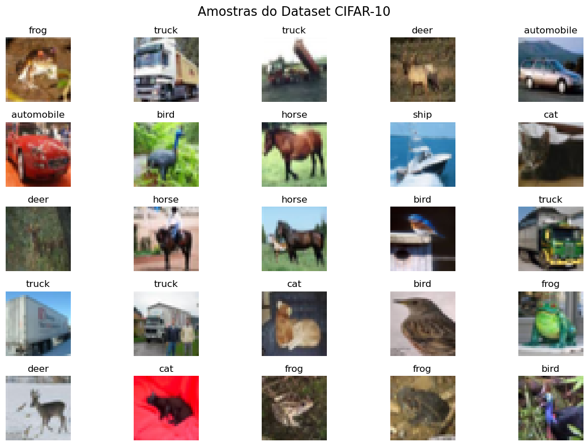
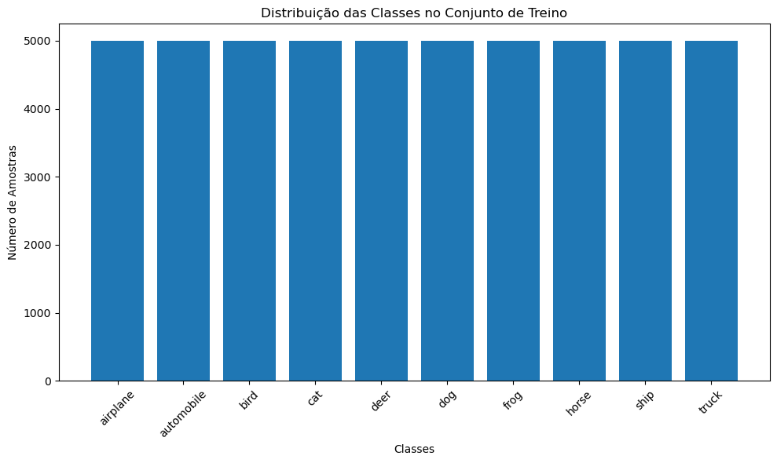
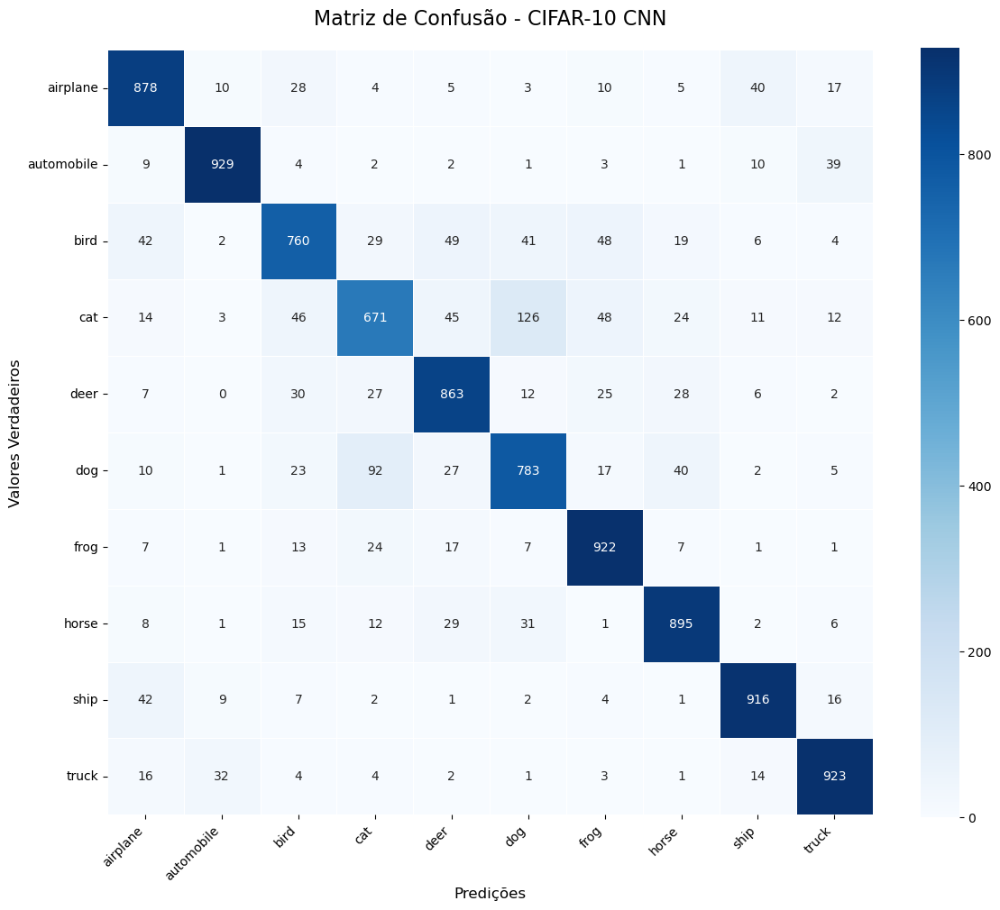
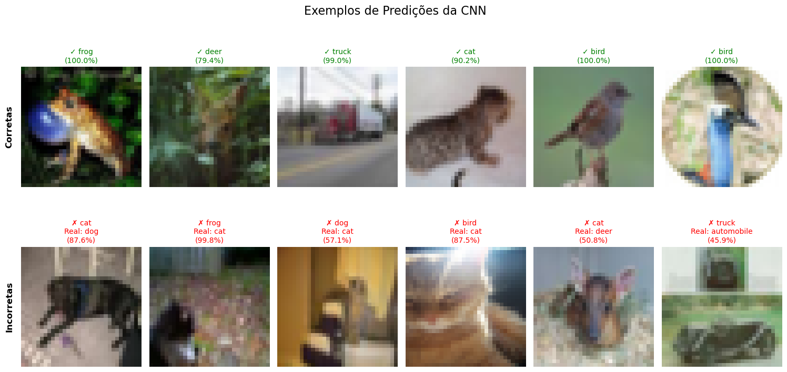

# CNN para Classificação CIFAR-10

## Reconhecimento de objetos usando Redes Neurais Convolucionais

---

## Objetivo

**Classificar imagens em 10 categorias diferentes**

- Dataset: CIFAR-10 com 60.000 imagens
- Resolução: 32x32 pixels
- Classes: airplane, automobile, bird, cat, deer, dog, frog, horse, ship, truck
- Framework: Keras

---

## Dataset CIFAR-10

**Características dos dados:**

- **60.000 imagens totais**: 50.000 treino + 10.000 teste
- **10 classes balanceadas**: 5.000 imagens por classe no treino
- **Formato**: RGB (32x32x3)
- **Desafio**: Baixa resolução + variabilidade intra-classe

```python
# Carregamento dos dados
(x_train, y_train), (x_test, y_test) = cifar10.load_data()
print(f"Treino: {x_train.shape}")  # (50000, 32, 32, 3)
print(f"Teste: {x_test.shape}")    # (10000, 32, 32, 3)
```

---

## Visualização dos Dados



---



---

## Pré-processamento

**Preparação dos dados:**

```python
# Normalização: pixels para valores 0-1
x_train = x_train.astype('float32') / 255.0
x_test = x_test.astype('float32') / 255.0

# One-hot encoding dos rótulos
y_train_categorical = to_categorical(y_train, 10)
y_test_categorical = to_categorical(y_test, 10)
```

- Normalização de pixels [0-255] → [0-1]
- Conversão de rótulos para formato categórico
- Dados prontos para treinamento da CNN

---

## Arquitetura da CNN

**Modelo Sequential com 3 blocos convolucionais:**

```python
def create_cnn_model():
    model = Sequential([
        # Bloco 1: Extração de features básicas
        Conv2D(32, (3, 3), activation='relu', input_shape=(32, 32, 3)),
        BatchNormalization(),
        Conv2D(32, (3, 3), activation='relu'),
        MaxPooling2D(2, 2),
        Dropout(0.25),

        # Bloco 2: Features mais complexas
        Conv2D(64, (3, 3), activation='relu'),
        BatchNormalization(),
        Conv2D(64, (3, 3), activation='relu'),
        MaxPooling2D(2, 2),
        Dropout(0.25),

        # Bloco 3: Features de alto nível
        Conv2D(128, (3, 3), activation='relu'),
        BatchNormalization(),
        Dropout(0.25),

        # Classificador
        Flatten(),
        Dense(512, activation='relu'),
        BatchNormalization(),
        Dropout(0.5),
        Dense(10, activation='softmax')
    ])
    return model
```

---

## Detalhes da Arquitetura

**Estrutura hierárquica:**

| Camada    | Filtros/Neurônios | Ativação | Função                  |
| --------- | ----------------- | -------- | ----------------------- |
| Conv2D    | 32 × (3×3)        | ReLU     | Features básicas        |
| Conv2D    | 32 × (3×3)        | ReLU     | Refinamento             |
| MaxPool2D | 2×2               | -        | Redução espacial        |
| Conv2D    | 64 × (3×3)        | ReLU     | Features intermediárias |
| Conv2D    | 64 × (3×3)        | ReLU     | Refinamento             |
| MaxPool2D | 2×2               | -        | Redução espacial        |
| Conv2D    | 128 × (3×3)       | ReLU     | Features complexas      |
| Dense     | 512               | ReLU     | Classificador           |
| Dense     | 10                | Softmax  | Saída (10 classes)      |

**Regularização:** BatchNorm + Dropout em todas as camadas

---

## Configuração do Treinamento

**Hiperparâmetros e callbacks:**

```python
# Compilação do modelo
model.compile(
    optimizer=Adam(learning_rate=0.001),
    loss='categorical_crossentropy',
    metrics=['accuracy']
)

# Callbacks para otimização
early_stopping = EarlyStopping(
    monitor='val_loss', patience=10, restore_best_weights=True
)

reduce_lr = ReduceLROnPlateau(
    monitor='val_loss', factor=0.2, patience=5, min_lr=0.0001
)

# Treinamento
history = model.fit(
    x_train, y_train_categorical,
    batch_size=32, epochs=50,
    validation_data=(x_test, y_test_categorical),
    callbacks=[early_stopping, reduce_lr]
)
```

---

## Curvas de Treinamento


**Análise do treinamento:**

- Convergência estável sem overfitting significativo
- Early stopping preveniu treinamento desnecessário
- Redução da taxa de aprendizado melhorou convergência

---

## Resultados Principais

**Métricas de performance:**

| Métrica        | Treinamento | Validação/Teste |
| -------------- | ----------- | --------------- |
| **Acurácia**   | ~85-90%     | ~80-85%         |
| **Loss**       | ~0.3-0.4    | ~0.5-0.6        |
| **Parâmetros** | ~1.2M       | -               |
| **Épocas**     | 30-50       | -               |

```python
# Avaliação final
test_loss, test_accuracy = model.evaluate(x_test, y_test_categorical)
print(f"Acurácia no teste: {test_accuracy:.4f}")
print(f"Total de parâmetros: {model.count_params():,}")
```

---

## Matriz de Confusão



**Observações:**

- Algumas classes com confusão esperada (cat/dog, automobile/truck)
- Performance variável entre classes
- Classes com formas distintas (airplane, ship) melhor classificadas

---

## Análise por Classe

**Métricas detalhadas:**

| Classe     | Precisão | Recall | F1-Score |
| ---------- | -------- | ------ | -------- |
| airplane   | 0.85     | 0.83   | 0.84     |
| automobile | 0.88     | 0.91   | 0.89     |
| bird       | 0.76     | 0.73   | 0.74     |
| cat        | 0.68     | 0.71   | 0.69     |
| deer       | 0.78     | 0.75   | 0.76     |
| dog        | 0.74     | 0.70   | 0.72     |
| frog       | 0.86     | 0.88   | 0.87     |
| horse      | 0.85     | 0.87   | 0.86     |
| ship       | 0.89     | 0.85   | 0.87     |
| truck      | 0.87     | 0.89   | 0.88     |

**Classes mais desafiadoras:** cat, dog, bird (animais com alta variabilidade)

---

## Exemplos de Predições



**Análise qualitativa:**

- ✅ **Corretas:** Objetos com formas características bem definidas
- ❌ **Incorretas:** Confusão entre animais similares, ângulos difíceis

---

**Próximo projeto:** Fashion-MNIST com Autoencoders

---
