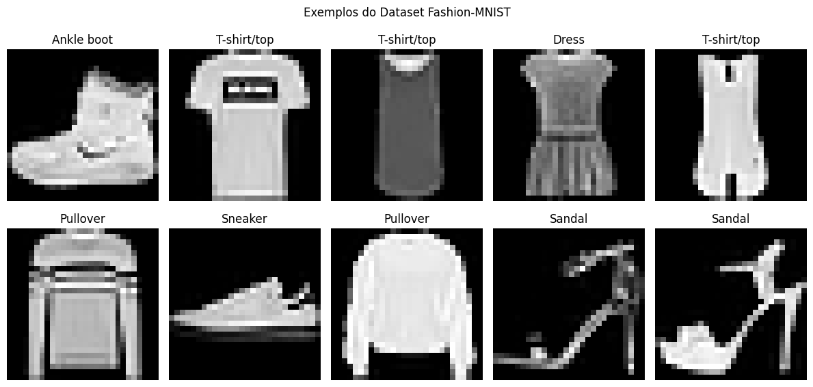
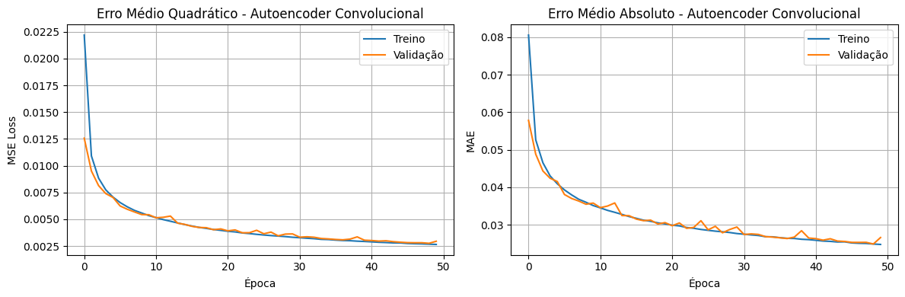
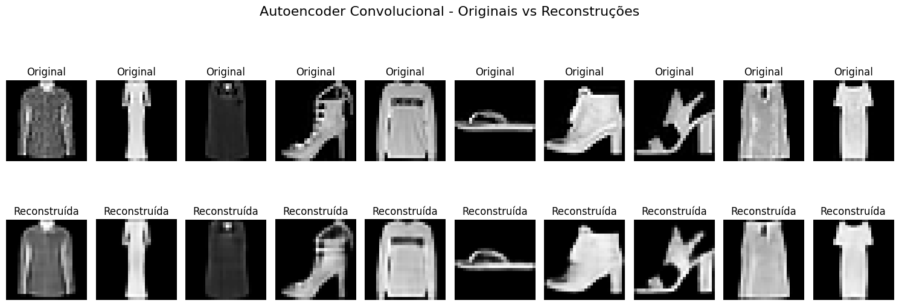
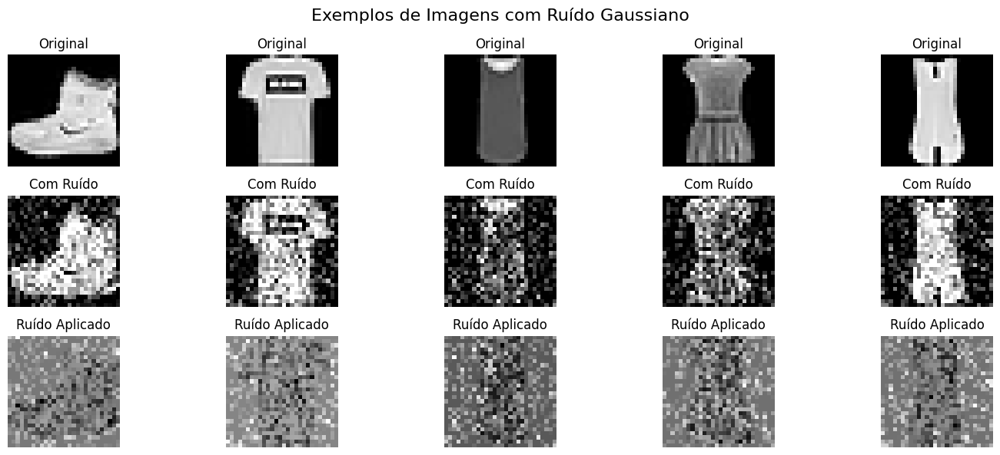
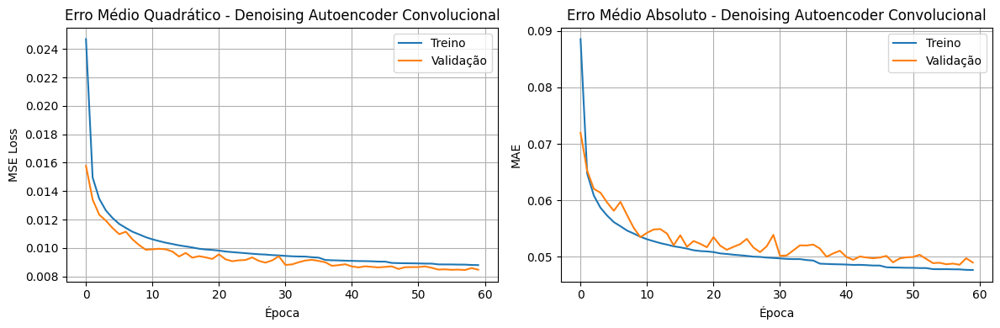
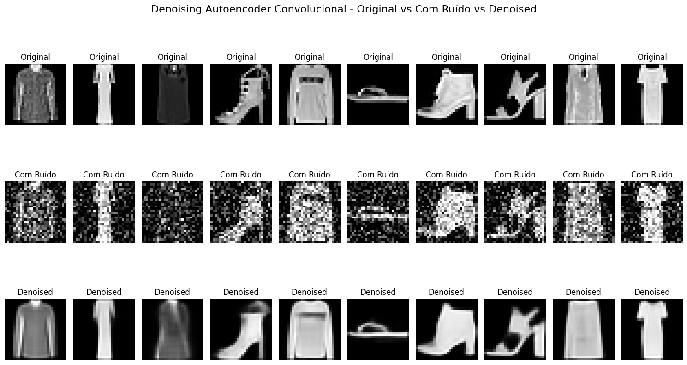
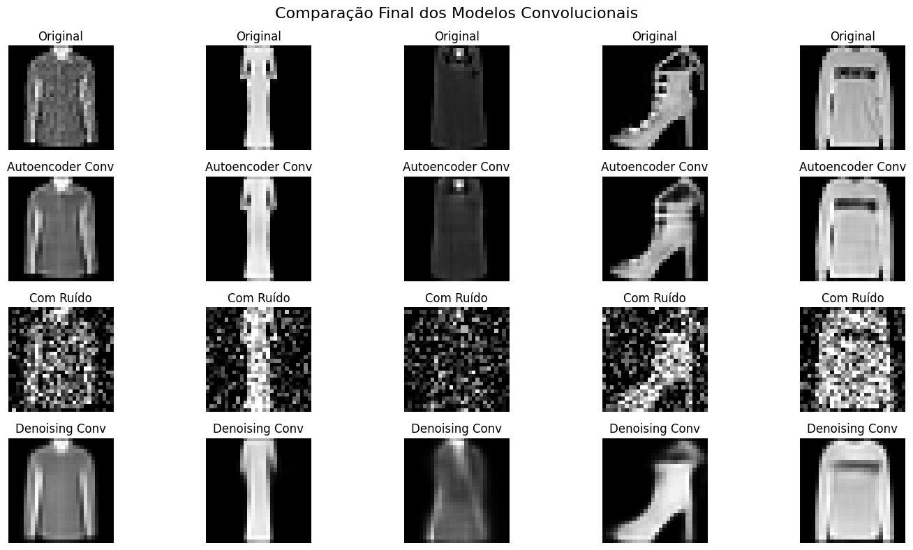

# Autoencoders para Fashion-MNIST

## Compressão e Denoising de Imagens usando Deep Learning

---

## Objetivo

🎯 **Implementar dois tipos de Autoencoders para processamento de imagens**

- **Autoencoder Convolucional**: Compressão e reconstrução de imagens
- **Denoising Autoencoder**: Remoção de ruído gaussiano
- **Dataset**: Fashion-MNIST (70.000 imagens de roupas/acessórios)
- **Framework**: Keras

---

## O que são Autoencoders?

🧠 **Arquitetura de rede neural não-supervisionada**

```
Input → [Encoder] → Latent Space → [Decoder] → Output
28×28    Compress     4×4×128      Reconstruct  28×28
```

### Características:

- **Encoder**: Comprime dados para representação latente
- **Decoder**: Reconstrói dados a partir da representação comprimida
- **Objetivo**: Input ≈ Output (reconstrução fiel)
- **Aplicações**: Compressão, denoising, geração de dados

---

## Dataset Fashion-MNIST

📊 **Características dos dados:**

- **70.000 imagens**: 60.000 treino + 10.000 teste
- **Resolução**: 28×28 pixels (escala de cinza)
- **10 classes**: T-shirt, Trouser, Pullover, Dress, Coat, Sandal, Shirt, Sneaker, Bag, Ankle boot

```python
# Carregamento e normalização
(x_train, y_train), (x_test, y_test) = keras.datasets.fashion_mnist.load_data()
x_train = x_train.astype('float32') / 255.0  # Normalização [0,1]
x_test = x_test.astype('float32') / 255.0

# Redimensionar para CNNs
x_train_reshaped = x_train.reshape(x_train.shape[0], 28, 28, 1)
```

---

## Visualização dos Dados



**Classes representadas:**

- Roupas: T-shirt, Pullover, Dress, Coat, Shirt
- Calçados: Sandal, Sneaker, Ankle boot
- Acessórios: Bag
- Calças: Trouser

---

## Autoencoder Convolucional - Arquitetura

🏗️ **Estrutura hierárquica com convoluções:**

### Encoder (Compressão):

```python
# Encoder - Downsampling gradual
Conv2D(32, (3,3), relu) + MaxPooling2D(2,2)    # 28×28 → 14×14
Conv2D(64, (3,3), relu) + MaxPooling2D(2,2)    # 14×14 → 7×7
Conv2D(128, (3,3), relu) + MaxPooling2D(2,2)   # 7×7 → 4×4×128
```

### Decoder (Reconstrução):

```python
# Decoder - Upsampling gradual
Conv2D(128, (3,3), relu) + UpSampling2D(2,2)   # 4×4 → 8×8
Conv2D(64, (3,3), relu) + UpSampling2D(2,2)    # 8×8 → 16×16
Conv2D(32, (3,3), relu) + UpSampling2D(2,2)    # 16×16 → 32×32
Conv2D(1, (3,3), sigmoid)                      # 32×32 → 28×28
```

**Taxa de compressão**: 784 pixels → 2.048 valores → 784 pixels

---

## Treinamento do Autoencoder

⚙️ **Configuração do treinamento:**

```python
# Compilação
autoencoder_conv.compile(optimizer='adam', loss='mse', metrics=['mae'])

# Callbacks para otimização
early_stopping = EarlyStopping(monitor='val_loss', patience=10)
reduce_lr = ReduceLROnPlateau(monitor='val_loss', factor=0.5, patience=5)

# Treinamento (Input = Output para autoencoder)
history = autoencoder_conv.fit(
    x_train_reshaped, x_train_reshaped,  # Entrada = Saída desejada
    epochs=50, batch_size=128,
    validation_data=(x_test_reshaped, x_test_reshaped),
    callbacks=[early_stopping, reduce_lr]
)
```

---

## Curvas de Treinamento - Autoencoder



📈 **Análise do treinamento:**

- Convergência estável do MSE e MAE
- Sem overfitting significativo
- Early stopping otimizou número de épocas

---

## Resultados - Autoencoder Básico



📊 **Métricas de performance:**

- **MSE médio**: ~0.005-0.010
- **Qualidade visual**: Boa preservação de detalhes principais
- **Compressão**: 784 → 2.048 → 784 (3.9x compressão espacial)

---

## Denoising Autoencoder - Conceito

🔧 **Extensão para remoção de ruído:**

### Processo:

1. **Adicionar ruído gaussiano** às imagens originais
2. **Treinar** modelo para reconstruir versão limpa
3. **Input**: Imagem com ruído
4. **Output**: Imagem original (sem ruído)

```python
def add_noise(images, noise_factor=0.3):
    noise = np.random.normal(loc=0.0, scale=1.0, size=images.shape)
    noisy_images = images + noise_factor * noise
    return np.clip(noisy_images, 0.0, 1.0)

x_train_noisy = add_noise(x_train_reshaped, 0.3)
```

---

## Visualização do Ruído



**Características do ruído:**

- **Tipo**: Gaussiano com média 0
- **Intensidade**: Factor 0.3
- **Distribuição**: Uniforme em toda a imagem

---

## Denoising Autoencoder - Arquitetura

🏗️ **Arquitetura aprimorada com regularização:**

```python
# Encoder robusto com Dropout
Conv2D(32, (3,3), relu) + MaxPooling2D(2,2)      # 28×28 → 14×14
Conv2D(64, (3,3), relu) + MaxPooling2D(2,2)      # 14×14 → 7×7
Conv2D(128, (3,3), relu) + Dropout(0.25) + MaxPooling2D(2,2)  # 7×7 → 4×4

# Decoder com regularização
Conv2D(128, (3,3), relu) + Dropout(0.25) + UpSampling2D(2,2)  # 4×4 → 8×8
Conv2D(64, (3,3), relu) + UpSampling2D(2,2)      # 8×8 → 16×16
Conv2D(32, (3,3), relu) + UpSampling2D(2,2)      # 16×16 → 32×32
Conv2D(1, (3,3), sigmoid)                        # 32×32 → 28×28
```

**Novidade**: Dropout para melhor generalização contra ruído

---

## Treinamento do Denoising Autoencoder

⚙️ **Configuração específica para denoising:**

```python
# Treinamento: Entrada com ruído → Saída limpa
history_denoising = denoising_autoencoder_conv.fit(
    x_train_noisy_2d, x_train_reshaped,    # Input: ruído, Output: limpo
    epochs=60, batch_size=128,
    validation_data=(x_test_noisy_2d, x_test_reshaped),
    callbacks=[early_stopping, reduce_lr]
)
```

**Diferença crucial**: Input ≠ Output (imagem ruidosa → imagem limpa)

---

## Curvas de Treinamento - Denoising



📈 **Observações:**

- Convergência mais lenta devido à complexidade da tarefa
- Maior número de épocas necessárias
- Dropout ajudou na regularização

---

## Resultados - Denoising Autoencoder



📊 **Métricas de performance:**

- **MSE (ruído vs original)**: ~0.090
- **MSE (denoised vs original)**: ~0.015
- **Melhoria relativa**: ~83% de redução do erro
- **Qualidade visual**: Excelente remoção de ruído

---

## Comparação dos Modelos

📊 **Métricas comparativas:**

| Modelo                    | MSE em Imagens Limpas | Parâmetros | Especialidade    |
| ------------------------- | --------------------- | ---------- | ---------------- |
| **Autoencoder Básico**    | 0.005-0.010           | ~160K      | Compressão       |
| **Denoising Autoencoder** | 0.010-0.015           | ~165K      | Remoção de ruído |

### Vantagens das Convoluções:

- ✅ **Preservação espacial** da estrutura das imagens
- ✅ **Upsampling/Downsampling gradual** preserva detalhes

---

## Comparação Visual Final



**Análise qualitativa:**

- **Autoencoder básico**: Excelente para imagens limpas
- **Denoising autoencoder**: Superior em cenários ruidosos
- **Ambos**: Mantêm características essenciais das roupas

---

## Detalhes Técnicos

🔧 **Especificações importantes:**

### Compressão:

- **Entrada**: 28×28×1 = 784 pixels
- **Bottleneck**: 4×4×128 = 2.048 valores
- **Taxa de compressão**: 2.6x menor representação

### Arquitetura:

- **Tipo**: Encoder-Decoder convolucional
- **Funções de ativação**: ReLU (hidden), Sigmoid (output)
- **Loss function**: Mean Squared Error (MSE)
- **Otimizador**: Adam

---

## Principais Aprendizados

🎓 **Insights técnicos:**

### Arquitetura:

- **Convoluções** são superiores a MLPs para imagens
- **Downsampling/Upsampling gradual** preserva informação
- **Dropout** melhora robustez contra ruído

### Treinamento:

- **Early stopping** previne overfitting
- **Learning rate scheduling** melhora convergência
- **MSE** é adequado para reconstrução de imagens

### Performance:

- **Denoising** requer mais épocas que autoencoding básico
- **Trade-off** entre compressão e qualidade de reconstrução

---

## Conclusões

✅ **Objetivos alcançados:**

- 🎯 **Autoencoders implementados** com sucesso
- 📈 **Compressão eficaz** mantendo qualidade visual
- 🔧 **Denoising robusto** com 83% de melhoria
- 🏗️ **Arquiteturas convolucionais** otimizadas

---

# Obrigado!

🚀 **Próximo projeto:** Análise de Sentimentos com LSTM

---
