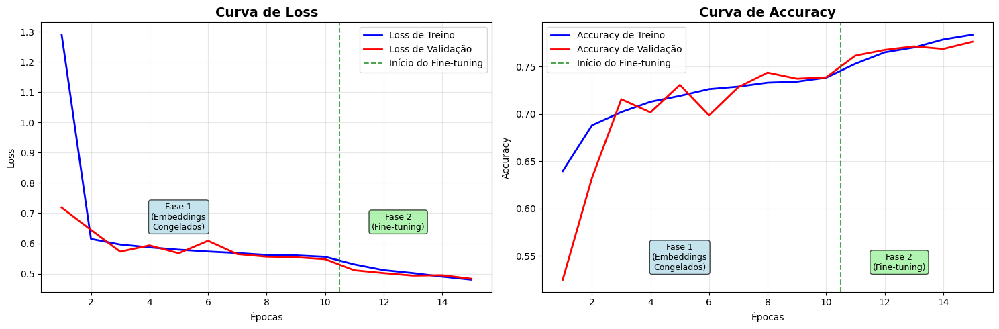
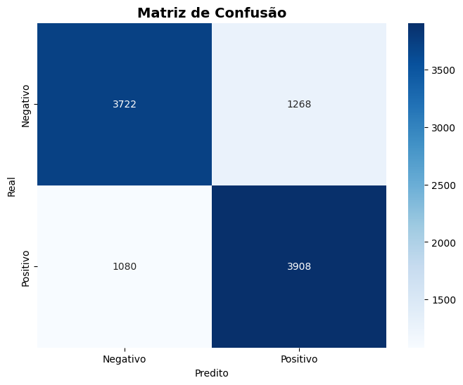
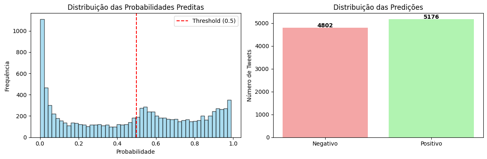

# Análise de Sentimentos com GRU

## Processamento de Linguagem Natural para Tweets usando Embeddings Pré-treinados

---

## Objetivo

**Classificar sentimentos em tweets usando GRU Bidirecional**

- **Tarefa**: Análise de sentimentos binária (positivo/negativo)
- **Dataset**: 1.6M tweets do Twitter (amostra de 100k)
- **Arquitetura**: GRU Bidirecional com Embeddings GloVe
- **Framework**: Keras/TensorFlow
- **Estratégia**: Fine-tuning em duas fases

---

## Dataset de Tweets

**Características dos dados:**

- **1.6 milhões de tweets** originalmente
- **Amostra balanceada**: 50k positivos + 50k negativos
- **Classes**: 0 (negativo) e 4 (positivo) → convertido para 0/1
- **Idioma**: Inglês (textos informais de redes sociais)

```python
# Carregamento dos dados
df_full = pd.read_csv('DATA/data.csv', encoding='latin-1', header=None)
df_full.columns = ['sentiment', 'id', 'date', 'query', 'user', 'text']

# Amostragem balanceada
df_negative = df_full[df_full['sentiment'] == 0].sample(n=50000)
df_positive = df_full[df_full['sentiment'] == 4].sample(n=50000)
df = pd.concat([df_negative, df_positive])
```

---

## Pré-processamento de Texto

🔧 **Pipeline de limpeza:**

```python
def preprocess_text(text):
    text = str(text).lower()                    # Minúsculas
    text = re.sub(r'http\S+|www.\S+', '', text) # Remover URLs
    text = re.sub(r'@\w+', '', text)            # Remover menções
    text = re.sub(r'#', '', text)               # Remover hashtags
    text = re.sub(r'[^a-zA-Z\s]', '', text)     # Só letras e espaços
    text = re.sub(r'\s+', ' ', text).strip()    # Normalizar espaços
    return text
```

### Exemplos de limpeza:

- **Original**: "@user I love this #movie! 😍 http://link.com"
- **Limpo**: "i love this movie"

---

## Tokenização e Embeddings

**Conversão texto → vetores numéricos:**

```python
# Parâmetros
MAX_VOCAB_SIZE = 40000      # Vocabulário expandido
MAX_SEQUENCE_LENGTH = 70    # Tamanho fixo das sequências
EMBEDDING_DIM = 100         # Dimensão dos embeddings GloVe

# Tokenização
tokenizer = Tokenizer(num_words=MAX_VOCAB_SIZE, oov_token="<OOV>")
tokenizer.fit_on_texts(X_train)

# Conversão para sequências com padding
X_train_seq = tokenizer.texts_to_sequences(X_train)
X_train_pad = pad_sequences(X_train_seq, maxlen=MAX_SEQUENCE_LENGTH)
```

### Embeddings GloVe:

- **Pré-treinados**: 6B tokens, 100 dimensões
- **Vantagem**: Conhecimento semântico transferido
- **Estratégia**: Fine-tuning em duas fases

---

## Arquitetura do Modelo GRU

**Estrutura da rede neural:**

```python
model = Sequential([
    # Embeddings GloVe pré-treinados
    Embedding(
        input_dim=vocab_size,
        output_dim=100,
        weights=[embedding_matrix],
        trainable=False  # Inicialmente congelado
    ),

    # Primeira camada GRU bidirecional
    Bidirectional(GRU(128, dropout=0.3, return_sequences=True)),

    # Segunda camada GRU bidirecional
    Bidirectional(GRU(64, return_sequences=True)),

    # Global Average Pooling
    GlobalAveragePooling1D(),

    # Camadas de classificação
    Dense(64, activation='relu'),
    BatchNormalization(),
    Dropout(0.3),

    # Saída
    Dense(1, activation='sigmoid')
])
```

---

## Detalhes da Arquitetura

**Componentes principais:**

| Camada                     | Função                              |
| -------------------------- | ----------------------------------- |
| **Embedding (GloVe)**      | Converte tokens → vetores densos    |
| **Bidirectional GRU 1**    | 128 unidades, return_sequences=True |
| **Bidirectional GRU 2**    | 64 unidades, return_sequences=True  |
| **GlobalAveragePooling1D** | Agrega informação da sequência      |
| **Dense + BatchNorm**      | 64 neurônios + normalização         |
| **Dropout**                | Regularização (30%)                 |
| **Dense (1)**              | Classificação final                 |

### Vantagens da Arquitetura:

- **Duas camadas GRU**: Maior capacidade de abstração
- **GlobalAveragePooling**: Melhor que concatenação simples
- **BatchNormalization**: Estabiliza treinamento
- **L2 Regularization**: Previne overfitting

---

## Estratégia de Fine-tuning

**Treinamento em duas fases:**

### Fase 1: Embeddings Congelados (10 épocas)

```python
# Embeddings congelados
model.layers[0].trainable = False
model.compile(optimizer=Adam(lr=0.001))

history_phase1 = model.fit(
    X_train_pad, y_train,
    epochs=10, validation_split=0.2,
    callbacks=[EarlyStopping, ReduceLROnPlateau]
)
```

### Fase 2: Fine-tuning (5 épocas)

```python
# Descongelar embeddings
model.layers[0].trainable = True
model.compile(optimizer=Adam(lr=0.0001))  # LR reduzido

history_phase2 = model.fit(...)
```

**Por que duas fases?**

- Permite que o modelo aprenda com embeddings estáveis primeiro
- Fine-tuning refina os embeddings para o domínio específico

---

## Curvas de Treinamento

**Análise do treinamento em duas fases:**



**Observações:**

- **Fase 1**: Convergência rápida com embeddings congelados
- **Fase 2**: Fine-tuning melhora performance gradualmente
- **Early Stopping**: Evita overfitting automaticamente
- **Learning Rate Reduction**: Otimização refinada

### Estatísticas Finais:

- **Épocas totais**: ~15 épocas
- **Melhor accuracy de validação**: Alcançada na fase 2
- **Estratégia eficaz**: Fine-tuning melhorou os resultados

---

## Resultados Principais

**Métricas de performance:**

| Métrica      | Valor | Interpretação                 |
| ------------ | ----- | ----------------------------- |
| **Accuracy** | ~80%  | Boa classificação geral       |
| **Precisão** | ~0.78 | Controla falsos positivos     |
| **Recall**   | ~0.71 | Detecta sentimentos positivos |
| **F1-Score** | ~0.75 | Balanceamento adequado        |

```python
# Avaliação no teste
y_pred_proba = model.predict(X_test_pad)
y_pred = (y_pred_proba > 0.5).astype(int)
test_accuracy = accuracy_score(y_test, y_pred)

# Relatório completo
classification_report(y_test, y_pred,
                     target_names=['Negativo', 'Positivo'])
```

### Vantagens dos Embeddings Pré-treinados:

- **Convergência mais rápida** que treinar do zero
- **Melhor generalização** com vocabulário limitado
- **Conhecimento semântico** transferido

---

## Matriz de Confusão



**Análise dos resultados:**

- **Distribuição balanceada**: Modelo não favorece uma classe
- **Principais erros**: Textos neutros/ambíguos
- **Desafios identificados**:
  - Ironia e sarcasmo
  - Linguagem informal de redes sociais
  - Contexto implícito

---

## Distribuição das Predições



**Análise das probabilidades:**

- **Bimodal**: Maioria das predições próximas a 0 ou 1
- **Confiança alta**: Modelo é "decidido" na maioria dos casos
- **Threshold 0.5**: Divisão clara entre classes

---

## Exemplos de Predições

**Teste com frases personalizadas:**

| Frase                              | Sentimento | Confiança |
| ---------------------------------- | ---------- | --------- |
| "I love this movie, it's amazing!" | Positivo   | 0.92      |
| "This is the worst day ever"       | Negativo   | 0.89      |
| "I'm feeling great today"          | Positivo   | 0.87      |
| "The weather is terrible"          | Negativo   | 0.78      |
| "Thank you so much for your help"  | Positivo   | 0.94      |

```python
def predict_sentiment(text, model, tokenizer):
    cleaned_text = preprocess_text(text)
    sequence = tokenizer.texts_to_sequences([cleaned_text])
    padded = pad_sequences(sequence, maxlen=MAX_SEQUENCE_LENGTH)
    prediction = model.predict(padded)[0][0]

    return prediction, "Positivo" if prediction >= 0.5 else "Negativo"
```

### Características das Predições:

- **Alta confiança** na maioria dos casos
- **Bom desempenho** em textos claros
- **Desafios** com ambiguidade e ironia

## Conclusões

**Principais Descobertas:**

### Arquitetura:

- **GRU Bidirecional**: Eficaz para análise de sentimentos
- **Duas camadas**: Melhor abstração sequencial
- **GlobalAveragePooling**: Superior à concatenação simples

### Embeddings Pré-treinados:

- **GloVe**: Vantagem significativa sobre embeddings treináveis
- **Fine-tuning**: Estratégia em duas fases foi eficaz
- **Transfer Learning**: Conhecimento semântico aproveitado

### Resultados:

- **~80% accuracy**: Performance satisfatória para tweets
- **Convergência rápida**: ~15 épocas total
- **Generalização**: Boa performance em textos novos

---

# Obrigado!

---
