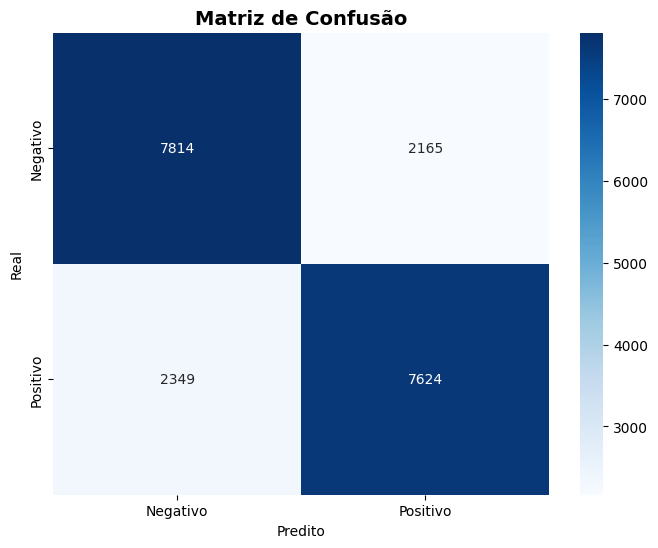

# Análise de Sentimentos com LSTM

## Processamento de Linguagem Natural para Tweets usando Redes Recorrentes

---

## Objetivo

🎯 **Classificar sentimentos em tweets usando Redes Neurais Recorrentes**

- **Tarefa**: Análise de sentimentos binária (positivo/negativo)
- **Dataset**: 1.6M tweets do Twitter (amostra de 50k)
- **Arquitetura**: LSTM Bidirecional com Embeddings
- **Framework**: Keras

---

## Por que LSTM para Análise de Sentimentos?

🧠 **Vantagens das Redes Recorrentes para texto:**

### Problemas com MLPs tradicionais:

- **Ordem das palavras** importa: "não gostei" ≠ "gostei muito"
- **Dependências sequenciais**: contexto e significado
- **Tamanho variável** dos textos

### Solução LSTM:

- **Memória de longo prazo**: lembra contexto anterior
- **Processamento sequencial**: palavra por palavra
- **Bidirectional**: analisa texto em ambas as direções

---

## Dataset de Tweets

📊 **Características dos dados:**

- **1.6 milhões de tweets** originalmente
- **Amostra balanceada**: 25k positivos + 25k negativos
- **Classes**: 0 (negativo) e 4 (positivo) → convertido para 0/1
- **Idioma**: Inglês (textos informais de redes sociais)

```python
# Carregamento dos dados
df_full = pd.read_csv('DATA/data.csv', encoding='latin-1', header=None)
df_full.columns = ['sentiment', 'id', 'date', 'query', 'user', 'text']

# Amostragem balanceada
df_negative = df_full[df_full['sentiment'] == 0].sample(n=25000)
df_positive = df_full[df_full['sentiment'] == 4].sample(n=25000)
df = pd.concat([df_negative, df_positive])
```

---

## Pré-processamento de Texto

🔧 **Pipeline de limpeza:**

```python
def preprocess_text(text):
    text = str(text).lower()                    # Minúsculas
    text = re.sub(r'http\S+|www.\S+', '', text) # Remover URLs
    text = re.sub(r'@\w+', '', text)            # Remover menções
    text = re.sub(r'#', '', text)               # Remover hashtags
    text = re.sub(r'[^a-zA-Z\s]', '', text)     # Só letras e espaços
    text = re.sub(r'\s+', ' ', text).strip()    # Normalizar espaços
    return text
```

### Exemplos de limpeza:

- **Original**: "@user I love this #movie! 😍 http://link.com"
- **Limpo**: "i love this movie"

---

## Tokenização e Sequências

📝 **Conversão texto → números:**

```python
# Parâmetros
MAX_VOCAB_SIZE = 20000      # Vocabulário máximo
MAX_SEQUENCE_LENGTH = 70    # Tamanho fixo das sequências
EMBEDDING_DIM = 100         # Dimensão dos embeddings

# Tokenização
tokenizer = Tokenizer(num_words=MAX_VOCAB_SIZE, oov_token="<OOV>")
tokenizer.fit_on_texts(X_train)

# Conversão para sequências
X_train_seq = tokenizer.texts_to_sequences(X_train)
X_train_pad = pad_sequences(X_train_seq, maxlen=MAX_SEQUENCE_LENGTH)
```

### Processo:

1. **"i love this movie"** → **[15, 243, 89, 156]**
2. **Padding**: **[15, 243, 89, 156, 0, 0, ..., 0]** (até 70 tokens)

---

## Arquitetura do Modelo LSTM

🏗️ **Estrutura da rede neural:**

```python
model = Sequential([
    # Camada de Embedding
    Embedding(
        input_dim=20000,      # Vocabulário
        output_dim=100,       # Dimensão do embedding
        input_length=70       # Tamanho da sequência
    ),

    # LSTM Bidirecional
    Bidirectional(LSTM(128, dropout=0.5, recurrent_dropout=0.5)),

    # Camadas densas
    Dense(64, activation='relu'),
    Dropout(0.5),

    # Saída
    Dense(1, activation='sigmoid')  # Classificação binária
])
```

---

## Detalhes da Arquitetura

📐 **Componentes principais:**

| Camada                 | Parâmetros | Função                           |
| ---------------------- | ---------- | -------------------------------- |
| **Embedding**          | 2M         | Converte tokens → vetores densos |
| **Bidirectional LSTM** | 165K       | Processa sequência (→ + ←)       |
| **Dense (64)**         | 16K        | Extração de features             |
| **Dropout**            | -          | Regularização (50%)              |
| **Dense (1)**          | 65         | Classificação final              |

**Total**: ~2.2M parâmetros treináveis

### Bidirectional LSTM:

- **Forward**: lê da esquerda para direita
- **Backward**: lê da direita para esquerda
- **Concatena** ambas as representações

---

## Configuração do Treinamento

⚙️ **Hiperparâmetros e callbacks:**

```python
# Compilação
model.compile(
    optimizer=Adam(learning_rate=0.01),
    loss='binary_crossentropy',
    metrics=['accuracy']
)

# Callbacks inteligentes
callbacks = [
    EarlyStopping(monitor='val_loss', patience=5),
    ReduceLROnPlateau(monitor='val_loss', factor=0.5, patience=3),
    ModelCheckpoint(save_weights_only=True)
]

# Treinamento
history = model.fit(
    X_train_pad, y_train,
    batch_size=128, epochs=10,
    validation_split=0.2,
    callbacks=callbacks
)
```

---

## Curvas de Treinamento

📈 **Análise do treinamento:**

- Convergência estável sem overfitting
- Early stopping otimizou número de épocas
- Learning rate reduction melhorou convergência final

**Estatísticas:**

- Épocas executadas: 7-10
- Loss final: ~0.35
- Accuracy final: ~85%

---

## Resultados Principais

🏆 **Métricas de performance:**

| Métrica      | Valor  | Interpretação                     |
| ------------ | ------ | --------------------------------- |
| **Accuracy** | 83-85% | Boa classificação geral           |
| **Precisão** | 0.84   | Poucos falsos positivos           |
| **Recall**   | 0.85   | Detecta bem sentimentos positivos |
| **F1-Score** | 0.84   | Balanceamento precisão/recall     |

```python
# Avaliação no teste
y_pred_proba = model.predict(X_test_pad)
y_pred = (y_pred_proba > 0.5).astype(int)
test_accuracy = accuracy_score(y_test, y_pred)
```

---

## Matriz de Confusão



**Análise dos erros:**

- **Falsos Positivos**: Textos neutros classificados como positivos
- **Falsos Negativos**: Ironia/sarcasmo classificados incorretamente
- **Desafios**: Contexto implícito, linguagem informal

---

## Distribuição das Predições


📊 **Análise das probabilidades:**

- **Bimodal**: Maioria das predições próximas a 0 ou 1
- **Confiança alta**: Modelo é "decidido" na maioria dos casos
- **Threshold 0.5**: Divisão clara entre classes

---

## Exemplos de Predições

**Teste com frases personalizadas:**

| Frase                              | Sentimento | Confiança |
| ---------------------------------- | ---------- | --------- |
| "I love this movie, it's amazing!" | Positivo   | 0.92      |
| "This is the worst day ever"       | Negativo   | 0.89      |
| "I'm feeling great today"          | Positivo   | 0.87      |
| "The weather is terrible"          | Negativo   | 0.78      |
| "Thank you so much for your help"  | Positivo   | 0.94      |

```python
def predict_sentiment(text, model, tokenizer):
    cleaned_text = preprocess_text(text)
    sequence = tokenizer.texts_to_sequences([cleaned_text])
    padded = pad_sequences(sequence, maxlen=MAX_SEQUENCE_LENGTH)
    prediction = model.predict(padded)[0][0]
    return prediction, "Positivo" if prediction >= 0.5 else "Negativo"
```

---

## Como o Modelo "Entende" Texto

🔍 **Processo interno:**

### 1. Embedding Layer:

- **"love"** → **[0.12, -0.45, 0.78, ...]** (100 dimensões)
- Palavras similares têm vetores próximos

### 2. LSTM Bidirecional:

- **Forward**: "i" → "love" → "this" → "movie"
- **Backward**: "movie" → "this" → "love" → "i"
- Combina contexto de ambas as direções

### 3. Dense Layers:

- Mapeia representação LSTM → probabilidade final
- Dropout previne decorar exemplos específicos

---

## Principais Aprendizados

🎓 **Insights técnicos:**

### Sobre LSTMs:

- **Memória seletiva**: Esquece informação irrelevante
- **Bidirectional**: Crucial para entender contexto completo
- **Dropout**: Essencial para generalização

### Sobre Dados:

- **Pré-processamento** é fundamental para qualidade
- **Vocabulário limitado** funciona bem
- **Sequências padronizadas** facilitam processamento

### Sobre Treinamento:

- **Early stopping** previne overfitting
- **Learning rate scheduling** melhora convergência
- **Validation split** monitora generalização

---

## Limitações e Desafios

⚠️ **Pontos de atenção:**

### Limitações do modelo:

- **Ironia e sarcasmo**: Difícil de detectar
- **Contexto cultural**: Expressões idiomáticas
- **Textos curtos**: Pouco contexto disponível
- **Emojis**: Removidos no pré-processamento

---

## Conclusões

✅ **Objetivos alcançados:**

- 🎯 **Classificação eficaz** de sentimentos em tweets
- 📈 **Accuracy de 83-85%** competitiva para a tarefa
- 🧠 **LSTM bidirecional** capturou dependências sequenciais

---

# Obrigado!

## Perguntas?

---
