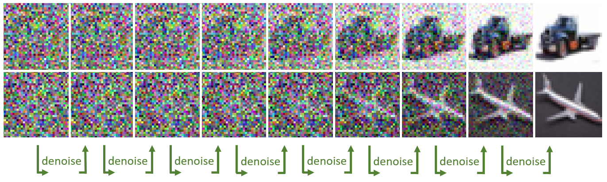
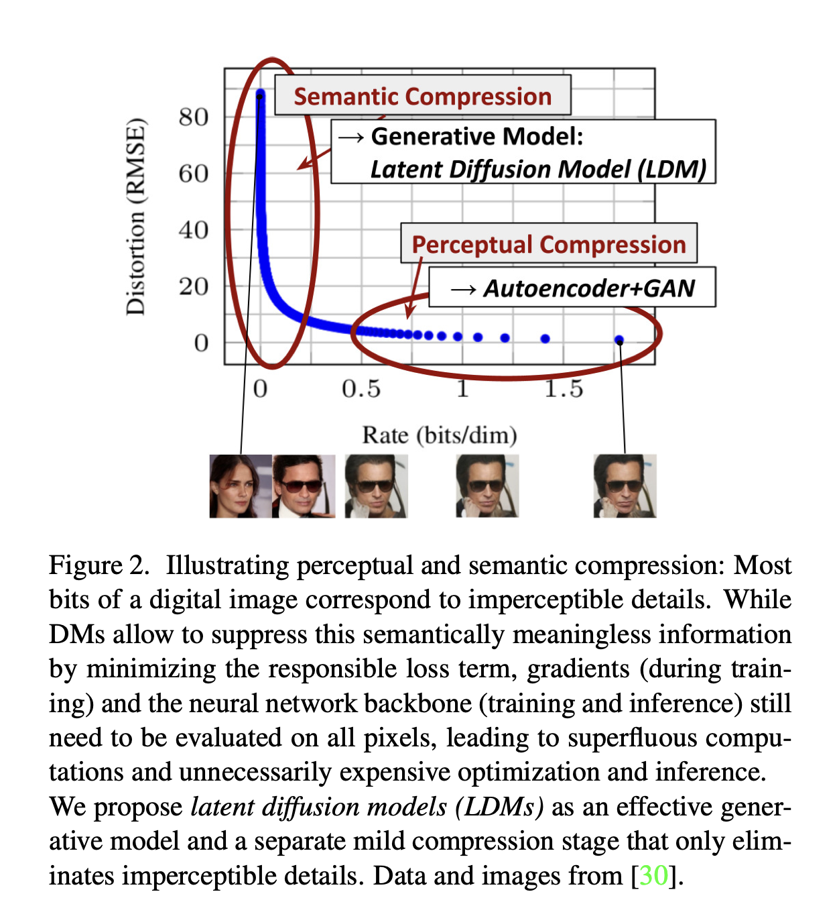
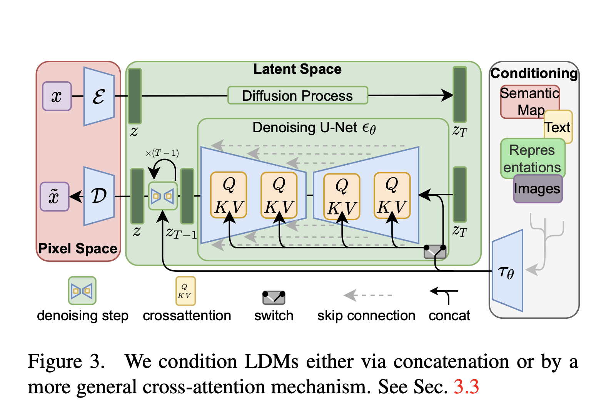
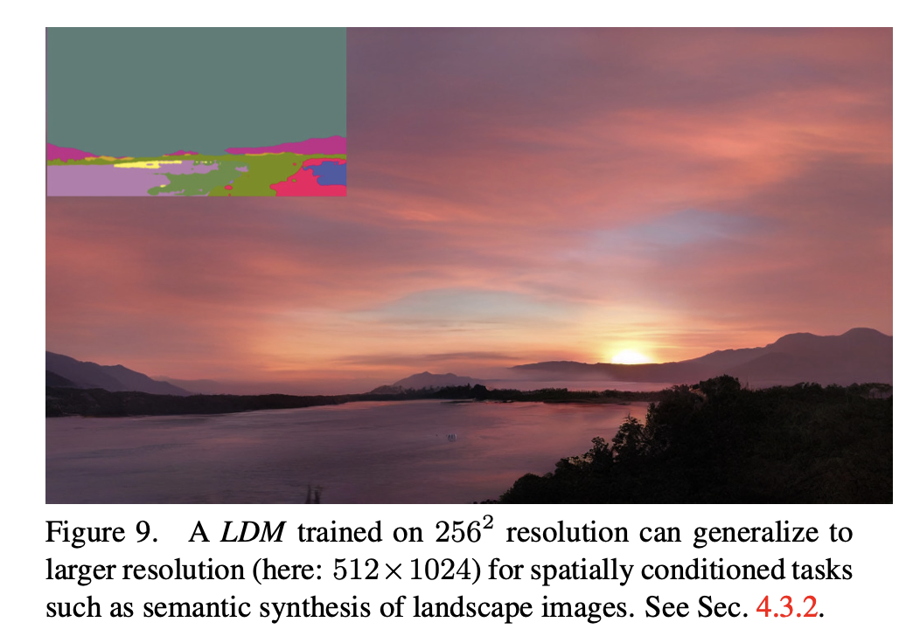
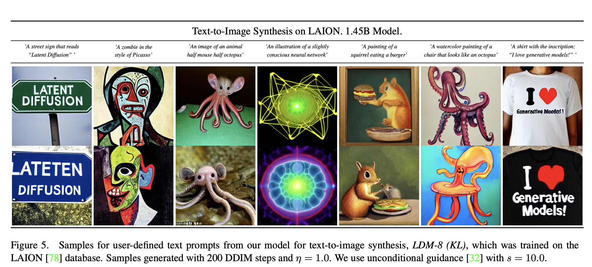
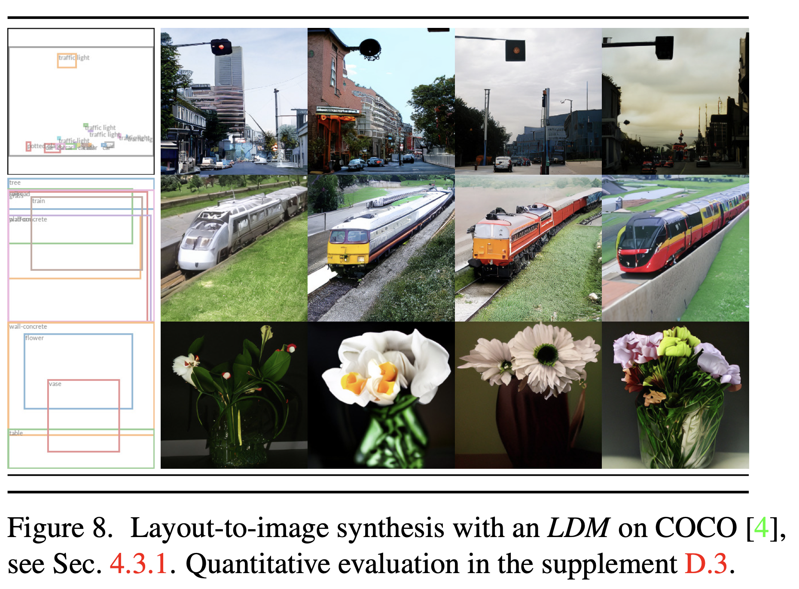
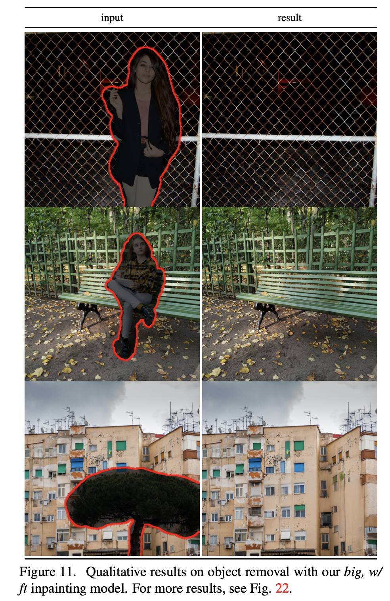
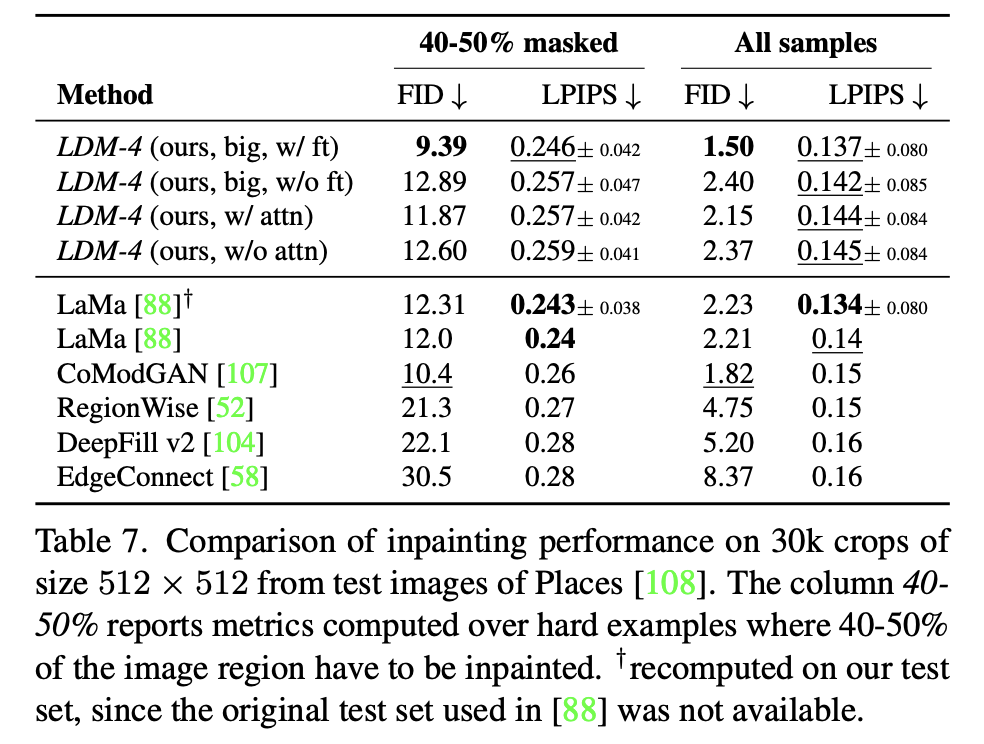
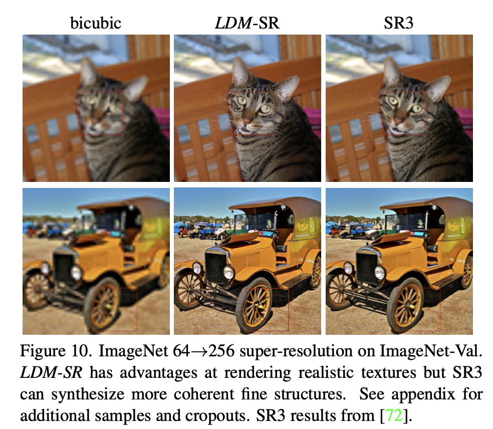
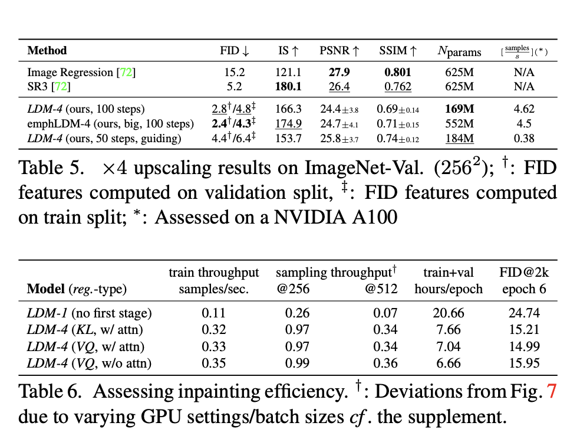

# Modelos de Difusão Latente (LDMs): Síntese de Imagem de Alta Resolução Eficiente

### Robin Rombach, Andreas Blattmann, Dominik Lorenz, Patrick Esser, Björn Ommer (2021)

---

# 1. O que são Modelos de Difusão (DMs)?

*   **DMs alcançam resultados de síntese de imagem de ponta** decompondo o processo de formação da imagem em uma aplicação sequencial de autoencoders de denoising.
*   Sua formulação permite um **mecanismo de guia** para controlar o processo de geração de imagem sem a necessidade de retreinamento.
*   São **modelos baseados em verossimilhança**, o que significa que não exibem colapso de modo ou instabilidades de treinamento, problemas comuns em GANs (Redes Adversariais Generativas).
*   Atualmente, DMs **definem o estado da arte** em síntese de imagem condicional por classe e super-resolução.

---

# 2. Desafios dos DMs em Pixel Space

*   **Custos Computacionais Elevados**: Modelos de difusão operam tipicamente diretamente no espaço de pixels, tornando a otimização muito cara.
    *   O treinamento de DMs poderosos pode consumir **centenas de dias de GPU** (e.g., 150-1000 dias V100).
*   **Inferência Lenta e Cara**: A avaliação sequencial de DMs no espaço de pixels torna a inferência cara.
    *   Produzir 50.000 amostras pode levar aproximadamente **5 dias em uma única GPU A100**.
*   **Impacto no Acesso e Meio Ambiente**: Esses altos requisitos computacionais limitam o acesso à tecnologia a uma pequena fração da comunidade de pesquisa e resultam em uma **grande pegada de carbono**.
*   **Ineficiência na Modelagem**: Modelos baseados em verossimilhança tendem a gastar uma quantidade excessiva de capacidade computacional modelando detalhes imperceptíveis dos dados, mesmo que sejam semânticamente insignificantes.

---

# 3. A Solução: Latent Diffusion Models (LDMs)

*   **Operando no Espaço Latente**: Os LDMs aplicam modelos de difusão no **espaço latente de autoencoders pré-treinados**.
*   **Redução de Complexidade vs. Preservação de Detalhes**: Ao treinar DMs nessa representação, eles alcançam pela primeira vez um ponto **quase ótimo entre a redução da complexidade e a preservação dos detalhes**, aumentando significativamente a fidelidade visual.
*   **Treinamento Acessível**: Essa abordagem permite o **treinamento de DMs em recursos computacionais limitados**, mantendo sua qualidade e flexibilidade.
*   **Democratização da Síntese de Imagem**: Os LDMs reduzem drasticamente os requisitos computacionais em comparação com os DMs baseados em pixels, tornando a **síntese de imagem de alta resolução mais acessível**.

---

# 4. Compressão Perceptual: A Primeira Fase

*   **Decomposição do Aprendizado**: O processo de aprendizado é dividido em duas fases distintas: a **compressão perceptual** e a **compressão semântica**.
*   **Autoencoder como Compressão Perceptual**: Primeiramente, um **autoencoder** é treinado para fornecer um espaço de representação de menor dimensão que é perceptualemente equivalente ao espaço dos dados originais.
*   **Remoção de Detalhes Irrelevantes**: Esta fase inicial remove detalhes de alta frequência e imperceptíveis, que consomem muitos bits em imagens digitais, mas têm pouco significado semântico.
*   **Reuso Eficiente**: A etapa de autoencoding universal precisa ser treinada **apenas uma vez** e pode ser reutilizada para múltiplos treinamentos de Modelos de Difusão ou para explorar tarefas completamente diferentes.
*   **Fidelidade na Reconstrução**: O modelo de compressão utiliza uma combinação de uma **perda perceptual** e um objetivo adversarial baseado em patches, garantindo reconstruções fiéis e evitando borrões.

---

# 5. Como os LDMs Funcionam (Visão Geral)

*   **Fase 1: Compressão Perceptual**
    *   Um autoencoder (`E` para codificar, `D` para decodificar) é treinado para transformar imagens de alta dimensão em um **espaço latente de baixa dimensão** `z`.
    *   Este espaço `z` mantém a informação perceptualmente relevante, mas remove detalhes de alta frequência e imperceptíveis.
*   **Fase 2: Geração Latente**
    *   Um **modelo de difusão é treinado no espaço latente comprimido** `z`.
    *   Isso permite que o DM se concentre nos bits semânticos e conceituais importantes dos dados, treinando em um espaço computacionalmente muito mais eficiente.
    *   O *backbone* neural do modelo é geralmente um **UNet condicional ao tempo** `εθ(◦, t)`.
    *   Durante a inferência, amostras geradas no espaço latente `p(z)` podem ser **decodificadas para o espaço da imagem** com uma única passagem através do decodificador `D`.

---

# 6. Mecanismos de Condicionamento

*   **Modelagem Condicional**: Modelos de difusão podem modelar **distribuições condicionais** na forma `p(z|y)`, onde `y` é alguma entrada condicionante.
*   **Autoencoder de Denoising Condicional**: Isso é implementado com um autoencoder de denoising condicional `εθ(zt, t, y)`, o que abre caminho para controlar o processo de síntese.
*   **Mecanismo de Cross-Attention**: Para tornar os DMs geradores de imagem condicional mais flexíveis, sua arquitetura UNet subjacente é **aumentada com o mecanismo de *cross-attention***.
    *   Este mecanismo é eficaz para aprender modelos baseados em atenção de várias modalidades de entrada.
*   **Codificador Específico de Domínio**: Um codificador específico de domínio (`τθ`) projeta a entrada condicionante `y` (como prompts de linguagem, mapas semânticos ou *bounding boxes*) para uma representação intermediária que é mapeada para as camadas do UNet via *cross-attention*.

---

# 7. Aplicações dos LDMs

Os LDMs demonstraram resultados favoráveis em uma ampla gama de tarefas de síntese de imagem:

*   **Síntese Incondicional de Imagem**: Geração de imagens sem qualquer entrada específica.
*   **Síntese de Imagem Condicional por Classe**: Geração de imagens baseadas em rótulos de classe.
*   **Síntese de Texto para Imagem (Text-to-Image)**: Criação de imagens a partir de descrições textuais, como "Um sinal de rua que diz 'Latent Diffusion'".
*   **Super-Resolução**: Aumento da resolução de imagens de baixa qualidade para alta resolução.
*   **Inpainting (Preenchimento de Imagens)**: Preenchimento de regiões mascaradas ou removendo conteúdo indesejado de imagens.
*   **Síntese Semântica (Layout-to-Image)**: Geração de imagens a partir de layouts semânticos.
*   **Geração de Imagens de Alta Resolução**: Capacidade de gerar imagens de megapixels (e.g., ~1024x1024 px) de forma convolucional.

---

# 7.1 Síntese de Texto para Imagem (Text-to-Image)

---

# 7.2 Síntese Semântica (Layout-to-Image)

---

# 7.3 Inpainting (Preenchimento de Imagens)

<!-- column_layout: [2, 1] -->

<!-- column: 0 -->

<!-- column: 1 -->

---

# 7.4 Super-Resolução

<!-- column_layout: [2, 1] -->

<!-- column: 0 -->

<!-- column: 1 -->

---

# 8. Vantagens Chave dos LDMs

*   **Eficiência Computacional Reduzida**: Treinamento e inferência são **significativamente mais baratos e rápidos** do que em DMs baseados em pixels.
*   **Qualidade Visual Aprimorada**: Atingem **novos estados da arte** em diversas tarefas de síntese de imagem, mantendo uma alta fidelidade visual.
*   **Flexibilidade e Generalização**: O mecanismo de *cross-attention* permite **condicionamento geral** (texto, mapas semânticos, etc.), tornando-os geradores flexíveis para múltiplas modalidades.
*   **Menor Número de Parâmetros**: Frequente requerem **menos parâmetros** do que modelos concorrentes.
*   **Evitam Trade-offs**: Previnem os *trade-offs* entre taxa de compressão e qualidade de reconstrução presentes em abordagens de dois estágios anteriores.
*   **Acessibilidade e Democratização**: Ao reduzir os custos, os LDMs **democratizam o acesso** à síntese de imagem de alta resolução e sua exploração.

---

# 9. Limitações e Impacto Social

*   **Velocidade de Amostragem**: O processo de amostragem sequencial dos LDMs ainda é **mais lento que o das GANs**.
*   **Precisão Fina**: Em tarefas que exigem precisão pixel a pixel (como em super-resolução com requisitos de alta exatidão), a capacidade de reconstrução dos autoencoders pode se tornar um gargalo.
*   **Preocupações Éticas (Faca de Dois Gumes)**: Modelos generativos são ferramentas poderosas com **potenciais usos indevidos**.
    *   **Desinformação e "Deep Fakes"**: A facilidade de criação e disseminação de dados manipulados pode ser usada para espalhar desinformação. Mulheres são desproporcionalmente afetadas por manipulações de imagem.
    *   **Vazamento de Dados de Treinamento**: Existe a preocupação de que modelos generativos possam revelar dados sensíveis ou pessoais de seus conjuntos de treinamento.
    *   **Reprodução e Exacerbação de Vieses**: Módulos de *deep learning* tendem a reproduzir ou agravar vieses já presentes nos dados de treinamento.

---

# 10. Conclusão

*   **Inovação e Eficiência**: Apresentamos os Modelos de Difusão Latente (LDMs) como uma maneira **simples e eficiente de melhorar significativamente a eficiência de treinamento e amostragem** de modelos de difusão de denoising, sem degradar sua qualidade.
*   **Resultados de Ponta**: Baseado nessa eficiência e no mecanismo de condicionamento por *cross-attention*, os experimentos demonstraram **resultados favoráveis em comparação com métodos de estado da arte** em uma ampla gama de tarefas de síntese de imagem condicional, sem a necessidade de arquiteturas específicas para cada tarefa.
*   **Avanço para a Comunidade**: A disponibilização de modelos pré-treinados de difusão latente e autoencoders visa facilitar o reuso e a exploração desta tecnologia.
*   Os LDMs representam um **avanço significativo na democratização da síntese de imagem de alta resolução**.
