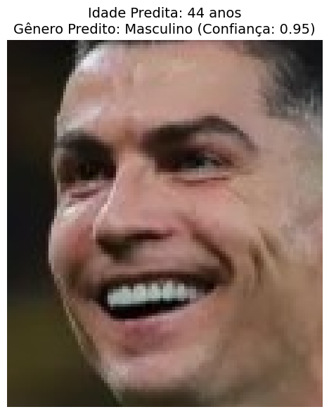
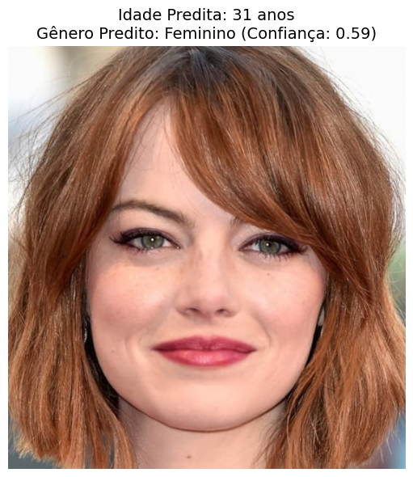

## Visão Geral do Projeto

**Objetivo**: Desenvolver um modelo de Deep Learning capaz de predizer simultaneamente a idade e o Sexo de pessoas a partir de imagens faciais.

**Dataset**: UTKFace
https://susanqq.github.io/UTKFace/

- Mais de 20.000 imagens faciais
- Estrutura: `[idade]_[sexo]_[etnia]_[data].jpg`
- Sexo: 0 = Masculino, 1 = Feminino
- Idade: 0 a 116 anos


---

## Arquitetura do Modelo

### AgeGenderNet

```
ResNet18 (Pré-treinado)
        ↓
    Features
    ↙      ↘
Age Head   Gender Head
(Regressão) (Classificação)
```

**Modelo Base**: ResNet18 pré-treinado (ImageNet)

**Duas cabeças de saída**:

- **Idade**: Regressão (MSE Loss)
- **Sexo**: Classificação binária (CrossEntropy Loss)

---

## Configuração e Hiperparâmetros

```python
BATCH_SIZE = 32
LEARNING_RATE = 0.001
NUM_EPOCHS = 30
IMAGE_SIZE = 224x224
```

**Otimizador**: Adam

- Learning Rate Scheduler: ReduceLROnPlateau
- Patience: 3 épocas
- Factor: 0.5

**Data Augmentation**:

- Flip horizontal aleatório
- Rotação (±10°)
- Ajuste de brilho e contraste

---

## Cabeça de Idade (Regressão)

```python
nn.Sequential(
    nn.Linear(512, 256),
    nn.ReLU(),
    nn.Dropout(0.5),
    nn.Linear(256, 128),
    nn.ReLU(),
    nn.Dropout(0.3),
    nn.Linear(128, 1)  # Saída: idade
)
```

**Função de Perda**: MSE (Mean Squared Error)

**Métrica**: MAE (Mean Absolute Error)

---

## Cabeça de Sexo (Classificação)

```python
nn.Sequential(
    nn.Linear(512, 256),
    nn.ReLU(),
    nn.Dropout(0.5),
    nn.Linear(256, 128),
    nn.ReLU(),
    nn.Dropout(0.3),
    nn.Linear(128, 2)  # Saída: [M, F]
)
```

**Função de Perda**: CrossEntropyLoss

**Métrica**: Acurácia

---

## Pipeline de Treinamento

1. **Carregamento de Dados**

   - Split: 80% treino / 20% validação
   - Custom Dataset para UTKFace

2. **Treinamento**

   - Forward pass: predições de idade e Sexo
   - Loss total = Loss_idade + Loss_Sexo
   - Backward pass e otimização

3. **Validação**

   - MAE para idade
   - Acurácia para Sexo

4. **Checkpoint**
   - Salva melhor modelo baseado em validation loss

---

## Funções de Perda

### Multi-task Learning

```python
loss_age = MSELoss(age_pred, age_true)
loss_gender = CrossEntropyLoss(gender_pred, gender_true)

loss_total = loss_age + loss_gender
```

**Estratégia**: Soma ponderada das perdas

---

## Métricas de Avaliação

### Idade

- **MSE Loss**: Erro quadrático médio
- **MAE**: Erro absoluto médio em anos
  - Mais interpretável
  - Objetivo: MAE < 7 anos

### Sexo

- **CrossEntropy Loss**: Penaliza predições incorretas
- **Acurácia**: Porcentagem de acertos
  - Objetivo: Acurácia > 90%

---

## Data Augmentation

```python
transforms.Compose([
    Resize(224x224),
    RandomHorizontalFlip(),      # Espelhamento
    RandomRotation(10),          # Rotação ±10°
    ColorJitter(0.2, 0.2),      # Brilho/Contraste
    ToTensor(),
    Normalize(ImageNet stats)
])
```

---

## Código: Dataset Customizado

```python
class UTKFaceDataset(Dataset):
    def __getitem__(self, idx):
        img_path = self.image_paths[idx]
        filename = os.path.basename(img_path)

        # Parse: [idade]_[Sexo]_[etnia]_[data].jpg
        parts = filename.split('_')
        age = int(parts[0])
        gender = int(parts[1])

        image = Image.open(img_path).convert('RGB')
        if self.transform:
            image = self.transform(image)

        return image, age, gender
```

---

## Código: Modelo Principal

```python
class AgeGenderNet(nn.Module):
    def __init__(self):
        super().__init__()
        self.backbone = models.resnet18(pretrained=True)
        num_features = self.backbone.fc.in_features
        self.backbone.fc = nn.Identity()

        # Duas cabeças independentes
        self.age_head = nn.Sequential(...)
        self.gender_head = nn.Sequential(...)

    def forward(self, x):
        features = self.backbone(x)
        age = self.age_head(features)
        gender = self.gender_head(features)
        return age, gender
```

---

## Visualização de Resultados

```python
def visualize_predictions(model, dataloader, num_images=8):
    # Exibe predições vs valores reais
    # - Idade predita vs idade real
    # - Sexo predito vs Sexo real
    # - Visualização da imagem original
```

**Exemplo de saída**:

```
Real: 25a, M     Pred: 27a, M
Real: 32a, F     Pred: 30a, F
Real: 45a, M     Pred: 43a, M
...
```

---

## Teste em Imagens Locais

```python
def test_on_local_image(model_path, image_path):
    model = AgeGenderNet()
    model.load_state_dict(torch.load(model_path))

    image = preprocess(image_path)
    age_pred, gender_pred = model(image)

    # Resultados com confiança
    return predicted_age, predicted_gender, confidence
```

**Uso**:

```python
age, gender, conf = test_on_local_image(
    'best_model.pth', 'teste.png'
)
```

---

## Pipeline

```
1. Carregamento de Dados
   ↓
2. Preprocessamento e Augmentation
   ↓
3. Treinamento Multi-task
   ↓
4. Validação e Métricas
   ↓
5. Salvamento do Melhor Modelo
   ↓
6. Visualização de Resultados
   ↓
7. Teste em Imagens Novas
```

---

## Exemplos

<!-- column_layout: [2, 1] -->

<!-- column: 0 -->


<!-- column: 1 -->





---

## Tecnologias que utilizei

- **PyTorch**: Framework de Deep Learning
- **torchvision**: Modelos pré-treinados e transforms
- **PIL**: Manipulação de imagens
- **NumPy**: Operações numéricas
- **Matplotlib**: Visualização
- **scikit-learn**: Split de dados
- **CUDA**: Aceleração GPU (opcional), usei Kaggle para treinamento

---
